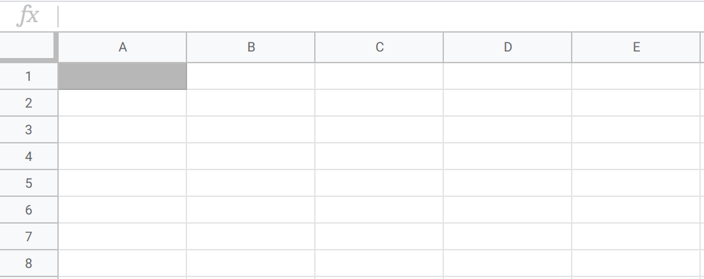
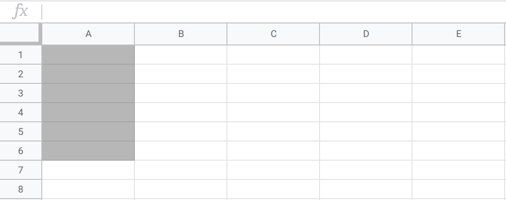
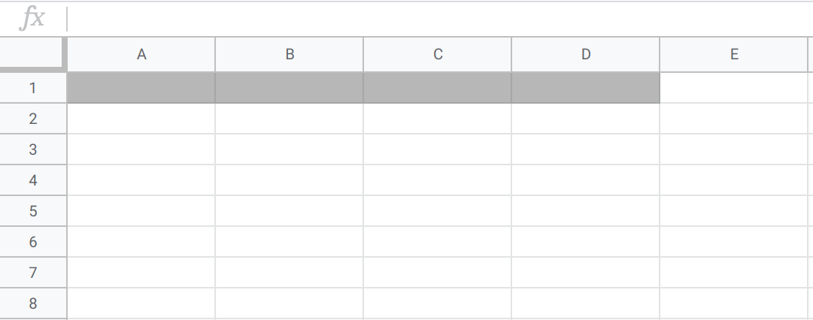

<!-- Copyright (C)  Google, Runestone Interactive LLC
  This work is licensed under the Creative Commons Attribution-ShareAlike 4.0
  International License. To view a copy of this license, visit
  http://creativecommons.org/licenses/by-sa/4.0/. -->

Count and Sum
=============

Two of the most basic but most used statistics are the count and sum of
a dataset.

#### Count Definitions

The **count** of a dataset is the number of observations in the dataset.
This applies to all variables.

#### Sum Definition

The **sum** of a dataset is the addition of all values in the dataset.
This applies only to quantitative variables.

Applications and Examples
-------------------------

The reason that the count is so important is that it can be an
indication of how useful the dataset is. For example, suppose you're
trying to find the average height of students at your college of 800
people, so you conduct a survey collecting students' heights. If your
survey contains only 2 heights, then using these results to calculate an
average won't be very useful, since this summary statistic is only
representative of 2 students. If, however, your survey contains 600
heights, calculating an average from these results will be more
reliable, since this statistic represents 600 of the 800 students.

As an example of using *count* and *sum*, suppose you are throwing a
homework party. You ask your friends to RSVP if they are attending and
to submit how many pizza slices they would like to eat, through a
survey. Knowing how many people would be attending will be helpful to
you when you purchase snacks, and you can use the *count* to calculate
the number of guests. You could also take the *sum* of the number of
pizza slices your friends want in order to get a better idea of how many
pizzas to order.

Calculating these statistics in Sheets is fairly straightforward. For
these and other statistics, you'll need to know **cell range notation**.
To refer to a range of cells in Sheets, type the first cell in the range
and the last cell in the range, separated by a colon. For example:

-   "A1" refers to cell A1

-   "A1:A6" means all cells in the A column from rows 1 through 6

-   "A1:D1" means all cells in the 1 row from columns A through D

-   "A1:D6" means all cells in rows 1 through 6 and columns A through D

#### Count and Sum Sheets Syntax

-   The `COUNT` function returns the number of non-empty cells in a
    range. The syntax is `=COUNT(cell range)`.
-   The `SUM` function returns the addition of a cell range. The syntax
    is `=SUM(cell range)`.

Example: Spotify Premium
------------------------

You and your roommates have been wanting to get [Spotify Premium on a
family plan](https://www.spotify.com/us/family/) for quite a while.
There are five of you, and you know that the plan allows up to six
accounts for \$15 per month. However, you are all on a very tight
college-student budget, and have very little cash to spare. You have
each gone through your expenses and have narrowed down exactly how much
money you each have to spare per month. Now you want to know, if you
pool your money together, whether you will have enough for Spotify
Premium!

You could use a calculator, but you prefer storing the data in a sheet,
because if any values were to change in the future, you could easily
update the sheet. First, you input all of your spare money into the
sheet. (Note you can click the "\$" symbol to format the numbers as
currency.)

First, use the `COUNT` function to verify that there are five rows in
this dataset, one for each person on the plan.

Now, use the `SUM` function to add up all the values.

Alas, you and your roommates are agonizingly short of the required \$15
per month! You'll have to keep trying to save just 90 cents more per
month to have enough for Spotify Premium.

### Fill in the blank

1. Your roommate who could previously contribute only \$1 has had some
luck! Her brother has decided to pay more of the Netflix family
membership (since he watches more anyway), so she can now contribute
\$2.50. How much money can you all pool together now?

2. Suppose cell B1 contains the amount of money between you and your
friends. Write a formula to check if this amount is enough for Spotify
Premium. If it is enough, the result should evaluate `TRUE`, otherwise
`FALSE`.

Answers

 
 
1. \$15.60
 
2. =IF(B1\>=15, TRUE, FALSE)

