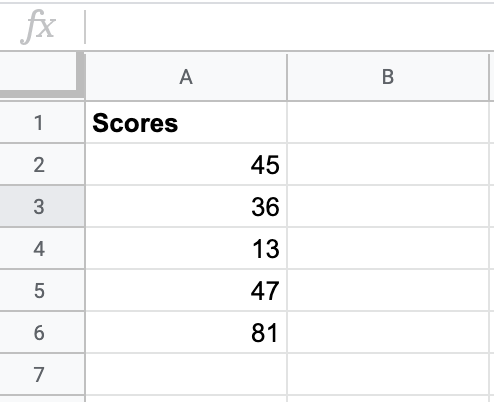
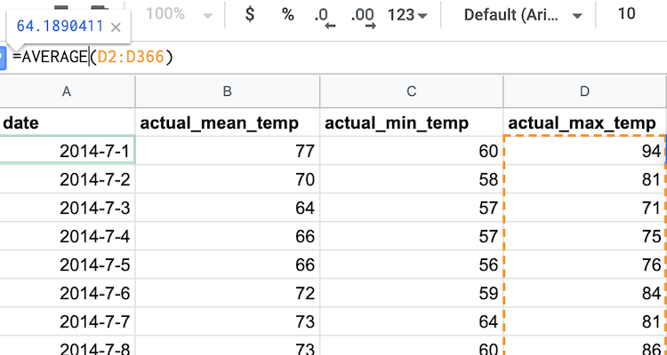

<!-- Copyright (C)  Google, Runestone Interactive LLC
  This work is licensed under the Creative Commons Attribution-ShareAlike 4.0
  International License. To view a copy of this license, visit
  http://creativecommons.org/licenses/by-sa/4.0/. -->

Measures of Center
==================

Some of the most widely used statistics are "measures of center," which
describe where the data is centered. This type of statistic is extremely
useful, as it allows you to summarize all the data with one
number/category. Statistics that summarize key aspects of the data are
called **summary statistics**.

You can think of a measure of center as a "best guess". If you had one
guess at the value of a new observation (e.g. the height of a new
student who joins the class), what would you guess?

#### The Three Measures of Center

The **mean** is the standard form of averaging.

-   The mean is calculated by adding up all the values in the data, and
    dividing by the number of data points.
-   The mean is only defined for quantitative variables.
-   Sometimes the mean is referred to simply as the "average" (for
    example in Sheets), but it is better to remember it as the mean.

The **median** is the middle value.

-   If you order all the data points from lowest to highest, the median
    is the value that sits directly in the middle.
-   If there are two "middle values" (which occurs when there is an even
    number of data points), the median is halfway between the two
    values.
-   The median is only defined for quantitative variables.
-   The median is the value such that half the values are below it, and
    half the values are above it.

The **mode** is the most commonly occurring value in the data.

-   If you count the number of times each category occurs, the mode is
    the category with the highest count.
-   Sometimes the mode is referred to simply as the most common value.
-   A dataset can have multiple modes - if multiple categories have the
    same count, and this count is higher than those of the other
    categories.
-   The mode is only defined for categorical variables.

When handling different types of data, some measures of center can tell
you more useful information than others can. Whenever you have a
categorical variable, the mode is your only choice for a measure of
center. However, with quantitative variables, either the mean or median
can be used to describe the "best guess". You can begin building
intuition about which of the three measures of center is most
appropriate through some examples.

### Multiple choice

1. You have a dataset on the birth country of all of your students. A new
student joins your class, and you want to take a "best guess" at where
she comes from. What measure of center would you use?

**A.** Mean

**B.** Median 

**C.** Mode

### Short answer

- You want to do a study on whether it is more expensive to rent an
apartment in Seattle or in New York City. What data would you collect to
answer this question, and what summary statistics could be useful?

The mean, median, and mode functions in Sheets all have the exact same
syntax as the `MIN` and `MAX` functions, defined earlier
[here](minimum_and_maximum.md). You can either input all relevant values into
the function separated by commas, or you can define a cell range. The latter is
far more convenient in most cases.

#### Measures of Center in Sheets

**The AVERAGE function returns the mean of a set of values.** You can
either input several values separated by a comma (e.g.
`=AVERAGE(value1, value2, value3)`), or you can input a range of cells
of which you want to know the mean (e.g. `=AVERAGE(A1:A10)`).

Note that mean is called AVERAGE in Sheets. It is nevertheless
recommended to use the term "mean" to describe this measure of center
wherever possible (e.g. in reports and articles), to disambiguate
different measures of center. [See here for a longer
discussion.](https://www.quora.com/What-is-difference-between-the-mean-and-the-average)

**The MEDIAN function returns the median of a set of values.** You can
either input several values separated by a comma (e.g.
`=MEDIAN(value1, value2, value3)`), or you can input a range of cells of
which you want to know the median (e.g. `=MEDIAN(A1:A10)`).

**The MODE function returns the mode of a set of values.** You can
either input several values separated by a comma (e.g.
`=MODE(value1, value2, value3)`), or you can input a range of cells of
which you want to know the mode (e.g. `=MODE(A1:A10)`).

Example: Test Scores
--------------------

Say you are helping grade for a class and your professor has given you a
list of student scores for the last exam. How would you calculate the
median and mode in sheets?

### Fill in the blank

2. Given the sheet above, write a formula for the mean of the test scores.

3. Given the sheet above, write a formula for the median of the test
scores.

Now that you have some practice with creating formulas to calculate
median and mean, you can start to build some intuition as to what the
differences between these measures of center may be. Say someone asked
you for your advice about where they wanted to move after graduation,
and that the weather was a major concern for them. You want to give them
a summary statistic to accurately summarize what the weather might be
like at those respective locations. Would the mean or median make more
sense? The next example can help you understand when you would want to
use the mean versus the median.

Example: Weather
----------------

First, calculate and compare the mean maximum daily temperature in
Seattle and New York City (NYC). The data for the two cities'
temperatures are in two different sheets.

The "actual\_max\_temp" is in column D, and tells you the maximum daily
temperature. Calculating the mean of that is as simple as using the
`AVERAGE` function on that cell range as shown in the image below. From
this, you can see that the mean maximum temperature in Seattle is 64.2
degrees.

You can now switch to the NYC sheet and use the exact same formula.

### Fill in the blank

4. What is the mean maximum temperature in NYC? (Use 1 decimal point.)

This example indicates that on average, over the course of twelve
months, Seattle and NYC have fairly similar temperatures. Does this seem
right to you?

In reality, for a given time of year, the temperatures of Seattle and
NYC usually differ significantly. NYC winters are considerably colder
than Seattle winters, and NYC summers tend to be warmer than Seattle
summers. When averaged over twelve months, however, these effects
"cancelled out", and, when looking just at the mean, it may look as if
Seattle and NYC have similar temperatures all year round.

Sometimes summary statistics can over-summarize the data. You will learn
more about how to take this over-summarization into account in the
[section on measures of spread](measures_of_spread.md). In the meantime, you can look closer into investigating the
median of this data.

### Short answer

- Calculate the median maximum temperatures for Seattle and NYC. Do these
statistics tell a different story? Why?

Right now, the mean and median may not seem all that different. However,
there are cases where the median is more useful than the mean. The
[next section on outliers](outliers_and_skew.md) will explain this difference through an example on family
income.

Answers

 
 
1. Mode
 
2. =MEAN(A1:A6)
 
3. =MEDIAN(A1:A6)

4. 61.7

