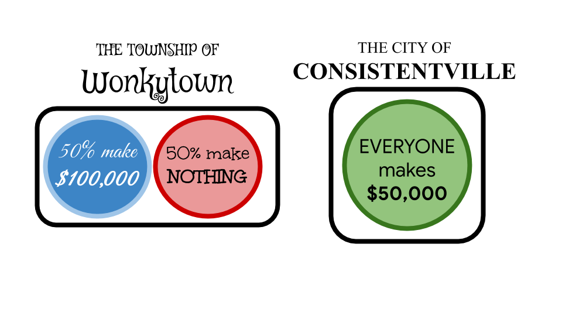
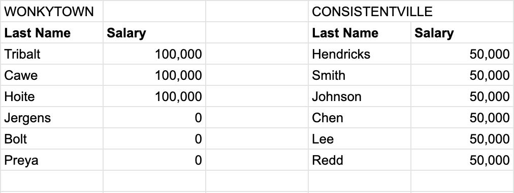
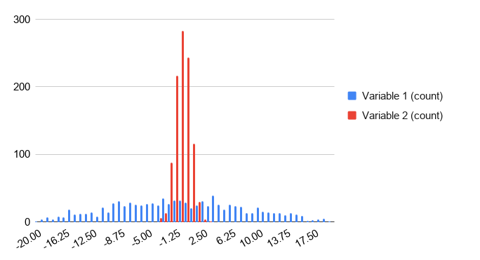
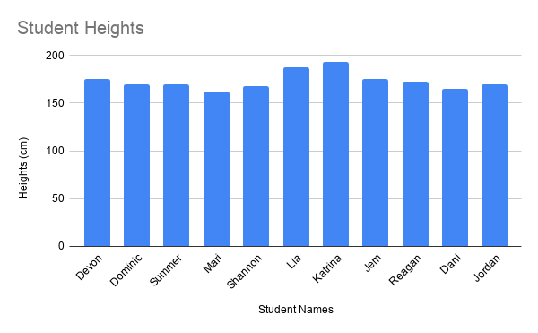

<!-- Copyright (C)  Google, Runestone Interactive LLC
  This work is licensed under the Creative Commons Attribution-ShareAlike 4.0
  International License. To view a copy of this license, visit
  http://creativecommons.org/licenses/by-sa/4.0/. -->

Measures of Spread
==================

Measures of center are very useful for giving you a "best guess" at a
variable. But how useful are those guesses?

In this section, you will learn about **standard deviation** and
**variance**. These are the most common \"measures of spread\"
statistics, since they indicate how spread out a dataset is. These
statistics are also used to inform how useful other statistics (such as
the mean) are for making predictions.

Trying to guess the value of a variable that doesn't change much is a
lot easier than trying to guess the value of a variable that can change
drastically. To take an extreme example, suppose there are two very
different cities next to each other. In "Consistentville", everyone has
the same yearly salary of \$50,000. In "Wonkytown" exactly half the
people have a yearly salary of \$100,000, and the other half are
unemployed.

### Fill in the blank

1. What is the mean salary in Consistentville? (Give your answer in
dollars.)

2. What is the mean salary in Wonkytown? (Give your answer in dollars.)

Since all residents of Consistentville make the same salary of \$50,000,
the mean salary is simply \$50,000. Now since exactly half the residents
of Wonkytown make \$100,000 and the other half make \$0, it should make
some intuitive sense that the mean salary in Wonkytown is also \$50,000.
So "on average," residents of Consistentville and Wonkytown make the
same salary.

### Short answer 

- If you take a random resident of Consistentville, what would you guess
their salary to be? Do you expect to be correct? What about in
Wonkytown?

If you take a random resident of Consistentville and guess their salary
to be the mean of \$50,000, you would be right every single time.
However, if you did the same in Wonkytown, you would be wrong every
single time! Not only would your guess be wrong, it would be either
\$50,000 below or \$50,000 above their true salary, both of which are
way off! So in this case, while the mean was an extremely effective
"best guess" in Consistentville, it was not so useful in Wonkytown.

In a city like Wonkytown, it is pretty hard to form a "best guess".
That's where measures of spread come in. A measure of spread statistic
doesn't refine a measure of center, but it can tell you how useful that
measure of center is. The most common measure of spread is called the
standard deviation.

#### Standard Deviation Definition

**The standard deviation is a measure of how spread out data points in a
dataset are.** A low standard deviation means the data points in the
dataset are generally close together. A high standard deviation means
the data points in the dataset are generally far apart.

By itself, the standard deviation can help you estimate how good your
"best guess" is. It is even more useful when comparing two different
datasets, as it can tell you which dataset is more spread out. In the
case of comparing Consistentville and Wonkytown, knowing the standard
deviation alone would tell you that in Consistentville everyone makes
the same salary, while in Wonkytown the salaries differ from the mean on
average by \$50,000. If you were guessing salaries, knowing the standard
deviation would help you make a much more informed guess!

Standard Deviation in a Histogram
---------------------------------

Look at the side-by-side histogram below. It contains two variables (one
in red and one in blue) with the same mean, but one with a much higher
standard deviation than the other.

### Multiple choice

3. Which variable do you think has a higher standard deviation?

**A.**   Red

**B.**   Blue

Example: Weather
----------------

Returning to the comparison of weather in Seattle and NYC, this example
shows you how to calculate the standard deviation of a dataset in
Sheets. Again, you will use the daily maximum temperature column.

#### Standard Deviation in Sheets

**The STDEVP function calculates the standard deviation of a dataset.**
As with previous summary statistic functions, you can either input
several values separated by a comma (e.g.
`=STDEVP(value1, value2, value3)`), or you can input a range of cells of
which you want to know the mean (e.g. `=STDEVP(A1:A10)`).

Note that there are several variants of the `STDEVP` function in Sheets.
In this section, you can always use the `STDEVP` function. If you are
interested in the difference between the different variants, [this
thread goes into some detail on the practical
differences](https://www.quora.com/What-is-the-difference-between-sample-standard-deviation-and-population-standard-deviation),
and [this thread goes into the mathematical theory behind the
difference](https://math.stackexchange.com/questions/15098/sample-standard-deviation-vs-population-standard-deviation).
In practice, there is not much numeric difference between the different
functions.

Finding the standard deviation of the maximum daily weather for Seattle
is almost the same as finding the average, except you use the `STDEVP`
function. This tells you that the standard deviation of the maximum
daily temperature in Seattle is 12.9 degrees.

### Fill in the blank

4. What is the standard deviation of the maximum daily temperature of NYC?
(Use 1 decimal point in your answer.)

You have already seen earlier in the weather example above. The
mean temperatures for Seattle and NYC differ only by 3 degrees. The
standard deviation shows you that the variability of the maximum daily
temperature is almost 7 degrees (more than 50%) higher in NYC compared
to Seattle.

This example should illustrate that knowing the mean sometimes isn't
enough. Just using the mean, you may have believed that Seattle and NYC
have very similar temperature all year round. Knowing the standard
deviation alongside the average, however, tells you that while Seattle
and NYC have similar mean temperatures, there is much higher year-round
variability in NYC. If you then add in the knowledge of the maximum and
minimum temperatures of both cities, you would have a pretty good idea
of the year-round temperature seasonality of both cities.

Extension: Variance
-------------------

This material is intended as a reference for those who are curious. It
describes, with more theory and mathematics, why variance is a crucial
concept for mathematicians and statistics.

While standard deviation is more widely used, it is actually derived
from another measure of spread, called the variance. More precisely,
**the standard deviation is the square root of the variance**. Many
[probability
distributions](https://en.wikipedia.org/wiki/Probability_distribution)
are defined in terms of mean and variance (not standard deviation). [You
can find another detailed explanation in this
article.](https://www.mathsisfun.com/data/standard-deviation.html)

#### Variance Definition

The variance is the mean of the squared deviation (or squared
difference) from the variable to its mean.

That is a lot of words. A better way to understand it is to outline the
procedure for calculating the variance of a dataset, call it dataset A.

1.  Calculate the mean of dataset A.
2.  Find the difference between the mean of dataset A and each value in
    dataset
    A.  These values form a new dataset, dataset B.
3.  Square all the values in dataset B. These values form a new dataset,
    dataset C.
4.  The mean of dataset C is the variance of dataset A.

More intuitively, dataset B shows you how far points in dataset A are
from the center of dataset A. Squaring the values in dataset B is a way
to make the differences all positive (to make sure values above and
below the mean are equally "far"). Then the mean of the squared
differences in dataset C tells you "on average" how far the points in A
are from the mean.

#### Variance in Sheets

**The VARP function calculates the variance of a dataset.** As with
previous summary statistic functions, you can either input several
values separated by a comma (e.g. `=VARP(value1, value2, value3)`), or
you can input a range of cells of which you want to know the mean (e.g.
`=VARP(A1:A10)`). (Note: the same caveat - shown in the weather example above - as with `STDEVP` applies to `VARP`.)

In Consistentville, every salary is \$50,000 and the mean is \$50,000.
Therefore, all values in dataset B are zero, so all values in dataset C
are zero. The mean of this all-zero dataset is zero, so the variance of
salary in Consistentville is zero. (This happens if and only if all
values in the dataset are the same.)

In Wonkytown, every salary is \$50,000 away from the mean (either above
or below). Therefore, all values in dataset B are \$50,000 so all values
in dataset C are the square of that, 2,500,000,000, in units of dollars
squared. The mean of dataset C, and therefore the variance of salary in
Wonkytown, is this same value.

One downside of the variance is its unit of measure. Since it involves
squaring the values of dataset B, the unit of measure of the variance is
always the squared unit of measure of the initial dataset (dataset A).
For example, if considering the salaries of Consistentville or
Wonkytown, the variance would be in squared dollars. This might not be
very useful, and this is how the standard deviation (square root of the
variance) came to be widely used. The purpose of the standard deviation
is to express the variance but in the same unit as the data. The
standard deviations of the salaries in Consistentville and Wonkytown are
measured in dollars.

In Consistentville, the variance is zero, so the standard deviation is
the square root of zero, which is also zero. In Wonkytown, the variance
is 2,500,000,000 dollars squared, so the standard deviation is the
square root of this, which is (you may have guessed it) \$50,000. Both
of these findings tell you just how far you can expect your guess to be
from the mean: \$0 in Consistentville, \$50,000 in Wonkytown.

Note that it is not always possible to calculate the variance and
standard deviation manually. Usually, you will have to use a tool such
as Sheets.

Example: Student Heights
------------------------

Suppose you have this
[dataset containing the heights of students in a class](https://docs.google.com/spreadsheets/d/1SbhCo8ZjEfFmBGwE7TLdsq-mxvMQa3hOmL5DMWF2ZTc/edit?usp=sharing).

First, use the method of calculating variance (above) to calculate the
variance and standard deviation of this dataset. Then, you can confirm
your answers using `VARP` and `STDEVP`.

### Fill in the blank

5. What is the variance of the heights among these students? (Use 1 decimal
point in your answer).

6. What is the standard deviation of the heights among these students? (Use
1 decimal point in your answer).

Further Application
-------------------

There are real-world applications that these measures of center can be
used for. [This exercise explores the salaries of professional
athletes](https://www.ck12.org/statistics/Applications-of-Variance-and-Standard-Deviation/rwa/Variance-of-a-Data-Set/)
with measures of spread as well as other statistics. Try this on your
own in Sheets if you are interested in getting more experience with any
of the previously learned statistics.

Answers

 
 
1. \$50,000
 
2. \$50,000
 
3. Blue: The blue values are spread out over a wide range.

4. 19.4

5. 10.5

6. 3.2

