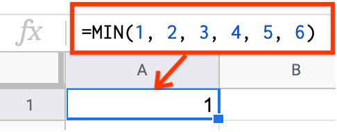
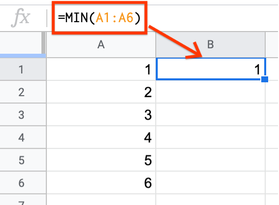

<!-- Copyright (C)  Google, Runestone Interactive LLC
  This work is licensed under the Creative Commons Attribution-ShareAlike 4.0
  International License. To view a copy of this license, visit
  http://creativecommons.org/licenses/by-sa/4.0/. -->

Minimum and Maximum
===================

The minimum and maximum of a dataset can be very useful statistics, and
are relatively simple to calculate. These statistics only apply to
quantitative variables.

#### Minimum Definition

The **minimum** value is the smallest value in the dataset, or the value
that all other values in the dataset are greater than or equal to.

#### Maximum Definition

The **maximum** value is the largest value in the dataset, or the value
that all other values in the dataset are less than or equal to.

The minimum or maximum value is sometimes the only value you need to
know. For example, suppose your university has organized a field trip
for your class to a concert, but the event is at a 21+ venue so people
under the age of 21 are not allowed in. In this case, knowing that the
minimum age of the students in your class is 21 is sufficient, as that
tells you that everyone in the class is at least 21 and that all members
of the class can go on the field trip.

Example: Dice Roll
------------------

Consider rolling a standard dice.

-   There are six faces.
-   Each face is equally likely to land face up.
-   The faces are labelled as follows: 1, 2, 3, 4, 5, 6.

It might seem unnecessary to use Sheets to calculate the minimum and
maximum possible results of a dice roll, but when there are thousands of
values instead of six, using Sheets or some other tool will be a
necessity.

You can calculate the minimum and maximum value in Sheets using the
`MIN` and `MAX` functions respectively.

#### Minimum and Maximum in Sheets

**The MIN function returns the minimum value of a set of values.** You
can either input several values separated by a comma (e.g.
`=MIN(value1, value2, value3)`), or you can input a range of cells of
which you want to know the minimum (e.g. `=MIN(A1:A10)`).

**The MAX function returns the maximum value of a set of values.** You
can either input several values separated by a comma (e.g.
`=MAX(value1, value2, value3)`), or you can input a range of cells for
which you want to know the maximum (e.g. `=MAX(A1:A10)`).

This example illustrates how to calculate the minimum value of a dice
roll using `MIN`, but the exact same logic and syntax applies to
calculating the maximum using `MAX`. As stated above, there are two ways
to calculate the minimum value of a dice roll.

In the first way, each value is input into the `MIN` function, separated
by a comma.

Alternately, you can specify all the values in different cells, and
input the cell range into the `MIN` function.

In future examples, you will see that specifying a cell range is the
more efficient way to use `MIN`, `MAX`, and other statistical functions.

Example: Weather
----------------

Suppose you want to know the minimum and maximum temperature that New
York City (NYC) generally experiences in a year.

The weather dataset previously seen
[here](variables.md) has the field
"actual\_min\_temp" which records the coldest temperature every day, and
a field "actual\_max\_temp" which records the highest temperature every
day. (For this example, only NYC weather is considered so the "city"
column is removed, and the month is not relevant so the "month\_text"
column is removed.)

### Fill in the blank

1. What is the coldest minimum temperature reached in NYC for the twelve
months?

2. What is the warmest maximum temperature reached in NYC for the twelve
months?

This dataset for twelve months contains just 365 data points. It would
be time-consuming but not impossible to scan each column visually and
find the minimum and maximum values. But imagine if this dataset covered
every day for one-hundred years! Sheets would be able to find the
minimum and maximum just as quickly as it did for twelve months. Doing
this manually, however, is error-prone and would not be fun.

Optional: Match
---------------

Knowing how to find the minimum and maximum values in a spreadsheet is
useful for many situations, but sometimes it can be even more useful to
know which row the minimum or maximum came from.

#### Match Definition

`MATCH` returns the relative position of an item in a range that matches
a specified value. We can use the `MATCH` function to find the row of
the minimum or maximum.

The `MATCH` function has three inputs and looks like this:
`MATCH(search_key, range, [search_type])`.

-   `search_key`: The value to search for
-   `range`: The values of the column that you want to search (ex.
    A1:A5)
-   `search_type`: The manner in which to search
    -   1 causes `MATCH` to assume that the range is sorted in ascending
        order and return the largest value less than or equal to
        search\_key
    -   0 indicates an exact match, and is required when the range is
        not sorted
    -   -1 causes `MATCH` to assume that the range is sorted in
        descending order and return the smallest value greater than or
        equal to `search_key`

To practice using `MATCH`, suppose a company called CandyData handed you
the [Halloween
Candy](https://github.com/fivethirtyeight/data/tree/master/candy-power-ranking)
dataset from FiveThirtyEight with information about various Halloween candies.
Suppose they ask you to find out which of the candies is most expensive. You know
that you need to find the row with the highest value in the Price
Percent column, so you can use the `MATCH` function!

Now you must start filling in the inputs for `MATCH`. The first input is
the value you're searching for. You're looking for the maximum value in
the column, and you know that to find the maximum value in a column you
can use the `MAX` function `(MAX(C2:C86))`. So now you can fill in the
first part of the `MATCH` function:
`MATCH(MAX(C2:C86), something, something)`.

The second input is the range of the values of the column that you want
to search. Since you want to find the value in the column called Price
Percent, you fill in the next part of the MATCH function:
`MATCH(MAX(C2:C86), C1:C86,  something)`.

Notice that if you use `C2:C86` instead of `C1:C86` instead, the row
value returned by the function will be shifted up by one, so the answer
will be 53 instead of 54. This is because the returned value is equal to
how far down the value is in the range, so when you omit the first row
in the range (`C1`), the returned value will be one less than the row
number because it's counting the rows starting at `C2`.

This is what that bug would look like if you were using a smaller
dataset and trying to find the state with the largest population:

The last input is the manner in which you want to search. Since the
values in Price Percent aren't sorted, you use 0. The final function is
`=MATCH(MAX(C2:C86), C1:C86, 0)`. The returned value is 46, meaning the
most expensive candy is in row 46. You can now go back CandyData and
tell them that \"Nik L Nip\" is the most expensive candy on the dataset.

Practice using the `MATCH`, `MAX`, and `MIN` functions to answer the
following questions:

### Fill in the blank

3. Which is the least expensive Halloween candy?

4. Which Halloween candy has the highest sugar percentage?

5. What is the most popular Halloween candy?

6. What is the least popular Halloween candy?

Answers

 
 
1. 2
 
2. 92
 
3. Tootsie Roll Midgies

4. Reeses stuffed with pieces

5. Reeses Peanut Butter Cup

6. Nik L Nip

