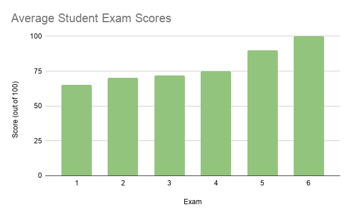
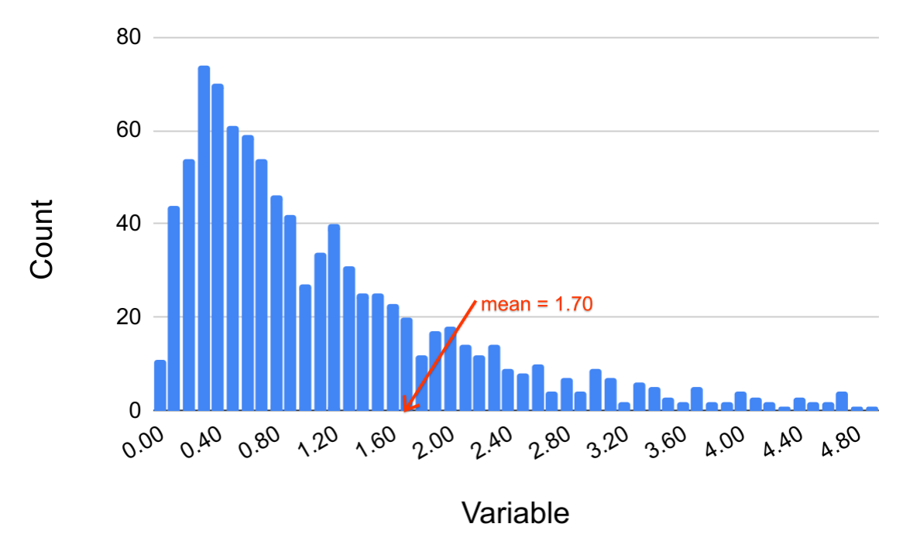
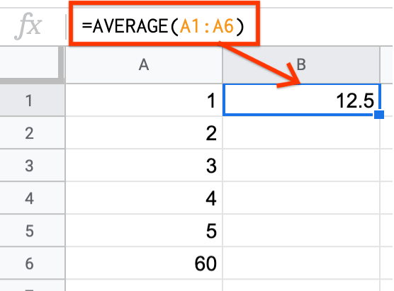
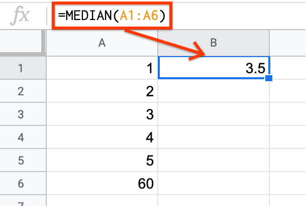

<!-- Copyright (C)  Google, Runestone Interactive LLC
  This work is licensed under the Creative Commons Attribution-ShareAlike 4.0
  International License. To view a copy of this license, visit
  http://creativecommons.org/licenses/by-sa/4.0/. -->

Outliers and Skew
=================

What would happen if you drastically altered one of the data points in a
dataset? For example, if you rolled a dice where the value of 6 is
replaced by 60? How does adding such a value, called an outlier, affect
the different measures of center?

#### Outlier Definition

**An outlier is a data point that is significantly far away from most
other data points.** For example, if everyone in your classroom is of
average height with the exception of two basketball players that are
significantly taller than the rest of the class, these two data points
would be considered outliers.

Outliers in a Histogram
-----------------------

Consider the histogram of student heights below.

In this example, there are two students whose heights are much greater
than the rest of the students. Lia\'s height is 188 centimeters (cm) and
Katrina\'s height is 193 cm. Taking the mean of the students\' heights
results in 168.45 cm.

Using the mean as the only summary statistic of a dataset can often be
misleading. For example, consider the effects if this school decided to
use the mean to decide how high the student desks needed to be. This
would result in desks that are too high for most students, but too small
for Lia and Katrina.

#### Skew Definition

**Skewness is a measure of asymmetry of a dataset.** For example, a
dataset has a skew if there are values far away from the mean on one
side (either above or below), but far fewer values the same distance
from the mean on the other side. A **positive skew** occurs when the
dataset contains values much greater than the mean but far fewer values
less than the mean. A **negative skew** occurs when the dataset contains
values much less than the mean but far fewer values much greater than
the mean.

Outliers and skew only pertain to quantitative variables. (For
categorical variables, there is no notion of "distance" between
different categories.)

Skew in a Histogram
-------------------

Consider the histogram of average exam scores below.

This is an example of negative skew. The mean is 81, and there are a
large number of values that are lower than 81. This large group of
values below the mean is called a **left tail**, and as such a negative
skew is often called a **left skew**. Similarly, a dataset with a
positive skew looks like a mirror image of the histogram above, with a
**right tail** and a **right skew**.

Example: Positive Skew
----------------------

Consider the histogram of a variable below.

While most of the data lies in the interval between 0 and 1.5, there are
values in the dataset that are much higher (but none that are below 0).
This is an example of a positive skew. An example of a real dataset that
might look like the histogram above is in the income examples below.

### Short answer

- What real-world variable do you think could have the histogram above?

- In the histogram above, do you think more of the values are above or
below the mean? How does that compare to the median? Will the median be
greater or less than the mean in this case?

- Find some examples of variables with left skew. Are there more data
points above or below the mean? How does the mean compare to the median?

Example: Dice Roll
------------------

Outliers have different effects on different statistics. For example, if
you change the 6 on a dice to 60, the minimum value of the roll is still
1, while the maximum value is now 60.

Outliers also have different effects on different measures of center.
See what happens to the mean and median for the dice roll when the 6 is
changed to a 60.

The mean of the dice roll is now 12.5! Only one value was changed, yet
the mean changed drastically.

In contrast, the median does not change at all. The median is considered
more "robust to outliers" than the mean. This means that as extreme
values become more extreme or as outliers are introduced into the
dataset, the median is less likely than the mean to be substantially
affected.

### Short answer

- What would happen to the mean and median if you change the 1 of a
standard dice to -10? What about if you change the 3 to 300?

Example: Income
---------------

Medians are especially useful when a dataset tends to lean towards
higher/lower values. This is called a **skew**. Consider the example of
income that has
[already been explored](measures_of_center.md). Income is an extremely skewed
dataset.
[You can read more about the income distribution here.](https://dqydj.com/income-percentile-calculator/)

The following is an excerpt from the [US census report on income from
2003](https://www.census.gov/prod/2003pubs/p70-88.pdf).

*"The distribution of wealth in the United States has a large positive
skew, with relatively few households holding a large proportion of the
wealth. For this type of distribution, the median is the preferred
measure of central tendency because it is less sensitive than the
average (mean) to extreme observations. The median is also considerably
lower than the average, and provides a more accurate representation of
the wealth and asset holdings of the typical household. For example,
more households have a net worth near the median of \$55,000 than near
the average of \$182,381."*

Since there are some households that earn extremely high incomes, just
these few values can affect the mean too much (in the same way that
changing 6 to 60 affected the mean for the dice roll). The median is
preferred in such contexts.

Further Application
-------------------

In the real world, skew is present in many different fields, including
economics. For more information about how skew affects financial
markets, see [this article on skewness in
finance.](http://www.fusioninvesting.com/2010/09/what-is-skew-and-why-is-it-important/)
