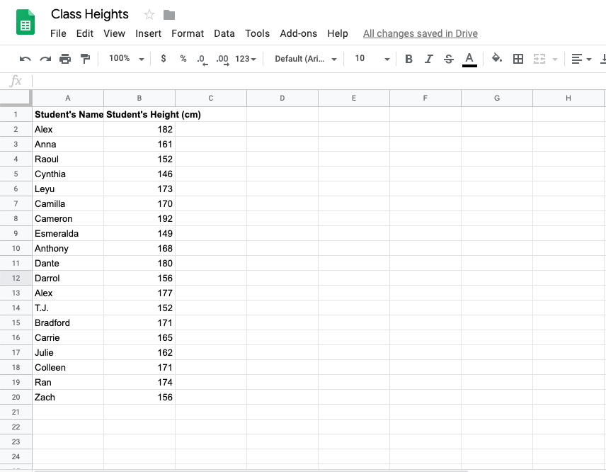
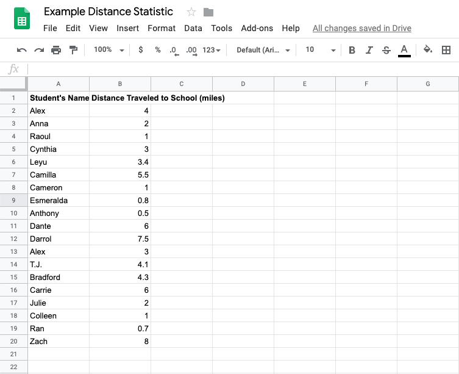

<!-- Copyright (C)  Google, Runestone Interactive LLC
  This work is licensed under the Creative Commons Attribution-ShareAlike 4.0
  International License. To view a copy of this license, visit
  http://creativecommons.org/licenses/by-sa/4.0/. -->

'What Is A Statistic?'
======================

Many people discuss statistics, but not everyone knows what a statistic
actually is.

#### Statistic Definition

**A statistic is a fact of the data.** A statistic is any piece of
information you can get from a set of data.

For example, suppose you have a dataset containing the heights of all
students in this class.

The following are all statistics from that dataset.

-   The shortest height is 146cm.
-   The tallest height is 192cm.
-   There are 19 students in this class.
-   The average height is 166.16cm.
-   The sum of all heights in the class is 3157cm.
-   Half the maximum height is 96cm.

Some statistics are more common and useful than others. For example,
knowing the average height will likely be more useful in real life than
knowing the sum of all heights. This chapter will guide you through the
most common descriptive statistics.

Suppose you have a dataset on how far students travel to get to school.

### Short answer

- What are some important statistics of the dataset above?