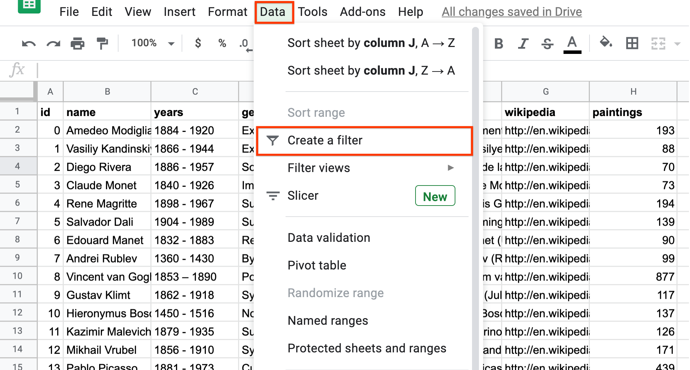
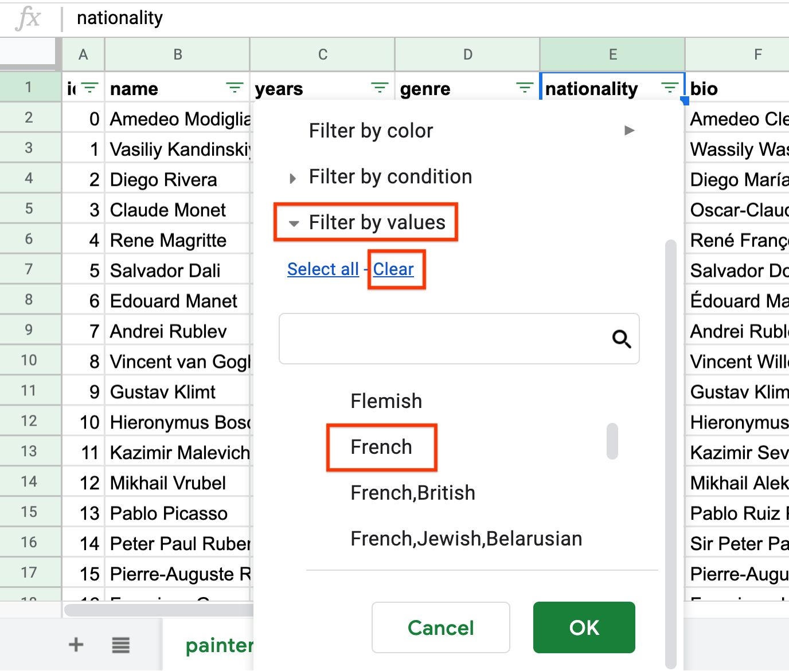
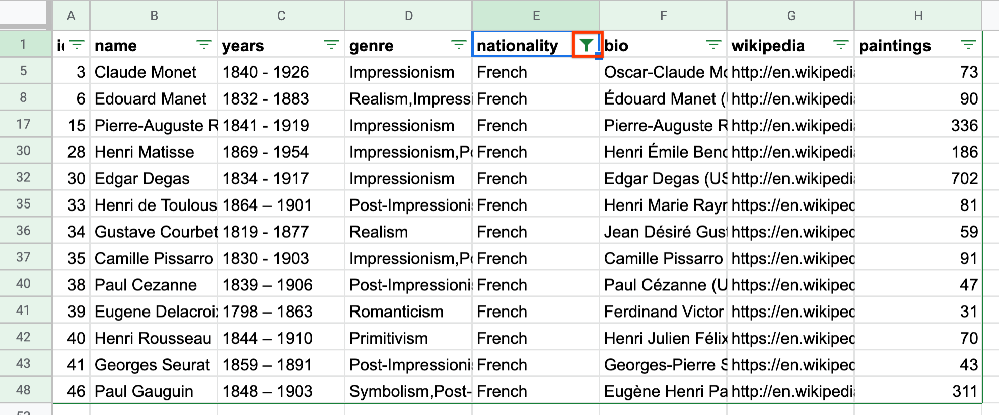
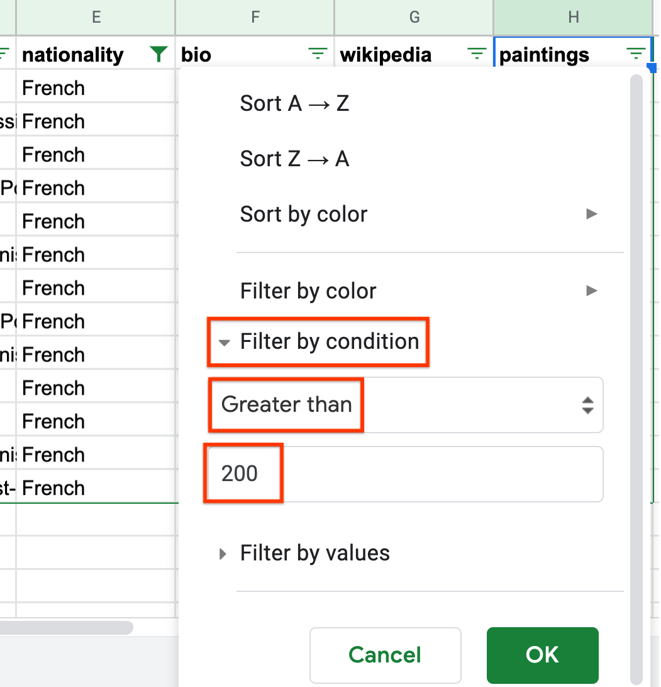
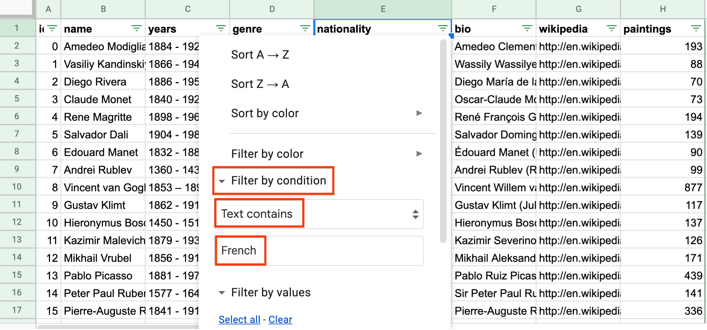
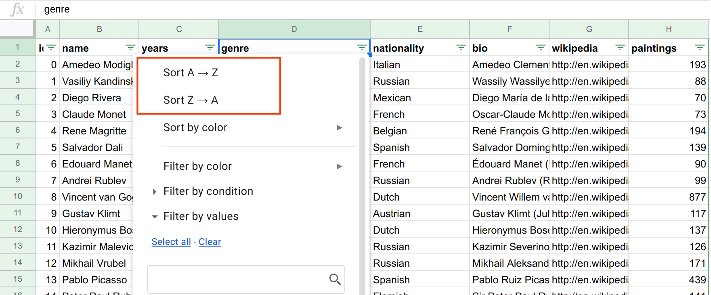
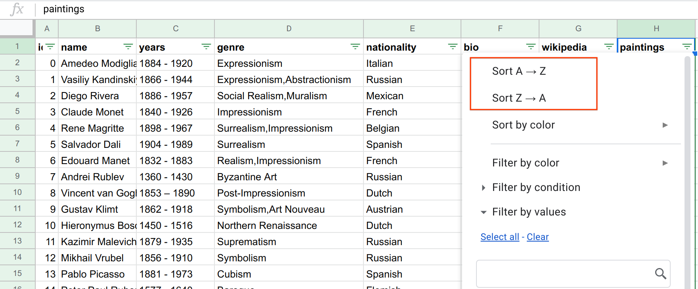

<!-- Copyright (C)  Google, Runestone Interactive LLC
  This work is licensed under the Creative Commons Attribution-ShareAlike 4.0
  International License. To view a copy of this license, visit
  http://creativecommons.org/licenses/by-sa/4.0/. -->

Filtering Data
==============

Sometimes, you want to look at an entire dataset. But at other times,
you may also be interested in just a specific subset of a dataset. For
example, if you have data on all of the USA, you may want to do data
analysis on a specific state only.

#### Filters in Sheets

**A filter is a way of selecting a subset of rows based on a set of
column conditions.** A "column condition" is a statement that restricts
the value in a column.

For example, if column A contains two-letter state codes of the USA, and
you wanted to subset the dataset to only rows corresponding to
California, the condition on that column would be `“=CA”`.

In Sheets, you can create a filter by clicking "Data \> Create a
filter". This creates a filter, assuming row 1 contains column headers,
for each column in the dataset. (Note that there is also a [FILTER
function](https://support.google.com/docs/answer/3093197?hl=en) in
Sheets that you can use in formulas. This is discouraged, since using
the formula is less intuitive than using the filter itself, and as such
this section does not cover it.)

Example: Painters
-----------------

A few chapters ago in
[this example](../sheets_basics/what_is_a_formula.md), you used formulas to filter a dataset of 
painters down to show only French painters who had painted over 200 paintings. 
For simplicity, that example assumed that a painter was French if French was
listed as their only nationality. This example illustrates how to
recreate that solution using filters, and also extends the example to
include French painters who also have other nationalities listed.

The first step is to add a filter to this dataset, by navigating to
"Data \> Create a filter". Make sure that your cursor is clicked
anywhere around the data that is to be filtered. In this example, it is
anywhere in the range A1:H51.

You should now see that each column, in row 1, has a filter icon. Now,
you can use this filter to filter down to rows where the nationality is
French. First, click on the nationality filter icon. In this case, you
are filtering by a value (an exact nationality). Pressing "Clear"
removes all selections. You can then select "French", either by
scrolling through the values, or by typing "French".

When you click "OK", the result will be only French painters, and the
nationality filter icon is now filled, rather than empty.

Now you can do the same for values of paintings greater than 200. In
this case, you are filtering by a condition, the condition that the
number of paintings is greater than 200. This is different than
filtering by a value, for example, if you were filtering for when number
of paintings is *equal to* 200.

So within the filter box, you should select "Filter by condition",
scroll to "Greater than", and type 200. This creates a filter
conditioning on the number of paintings being greater than 200.

Once this is done, the green filter icon should be filled, and you
should see only three rows left. Specifically, the same three painters
found using formulas in the previous example: Renoir, Degas, and
Gauguin.

### Multiple choice

1. Filter this dataset to find all Italian (exclusively Italian) painters
who painted fewer than 100 paintings.

**A.**   Raphael

**B.**   Caravaggio

**C.**   Michelangelo

**D.**   Eugene Delacroix

Filters make this kind of exercise significantly easier. What was
previously a complicated formula is now just two simple filters.
Moreover, filters allow you to be more specific with your conditions,
which makes them a powerful but easy tool to use. Suppose, instead of
looking at painters who only have French nationality, you now want to
look at painters for whom *at least one* of their nationalities is
French. (For example, this includes Alfred Sisley, whose nationalities
are French and British.)

Since this filter is not based on an exact equality, you need to use a
"Filter by condition". You can change the filter applied to the
"nationality" column, from a "Filter on values" to a "Filter on
condition". You can scroll to "Text contains", then type the word
"French".

### Fill in the blank

2. Find the only two painters associated with any form of Impressionism
(including Post-Impressionism), but who do not have French listed as a
nationality. (Write the full names as spelled in the sheet. Use the
order of the ID in the sheet.) (Hint: Use "Text (does not) contain(s)"
under "Filter by condition".) and

Sorting Data
------------

Now you will see how a Filter in Sheets can also be used to easily sort
data.

Data is often unordered, which can make it difficult to examine
visually. Sorting data allows you to order columns. Most of the ordering
you will come across is either numeric or text.

-   Numeric data can be ordered "lowest to highest" or "highest to
    lowest".
-   Text data can be ordered alphabetically "A-Z" or "Z-A".

Sorting can be useful if you just want to see the top or bottom values
of a dataset. For example, if you have a list of bills you need to pay
this month, you can order it by total amount owed to see the cost of the
most expensive and least expensive bill you have to pay.

If you have already set up a Filter in Sheets, sorting comes for free.
For example, suppose you wanted to sort the painters dataset
alphabetically by genre.

Note that you can sort "A-Z" or "Z-A". If you try to sort a numeric
column, you will see the same options ("A-Z" or "Z-A"), but these will
act as numeric sorters, and denote "lowest to highest" and "highest to
lowest" respectively.

### Fill in the blank

3. Which painter was born the earliest? (Enter the painter's name as it
appears in the spreadsheet.)

4. Which of the painters whose first names start with A painted the fewest
paintings? Hint: You may need to create a new table with a new filter.
(Enter the painter's name as it appears in the spreadsheet.)

Answers

 
 
1. Caravaggio, Michelangelo
 
2. Rene Magritte, Vincent van Gogh (should be in this order)
 
3. Giotto di Bondone

4. Andrei Rublev

