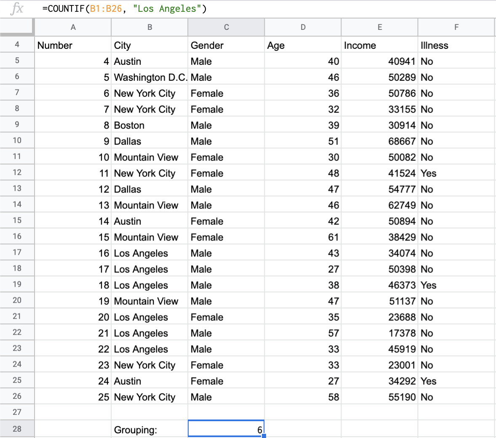
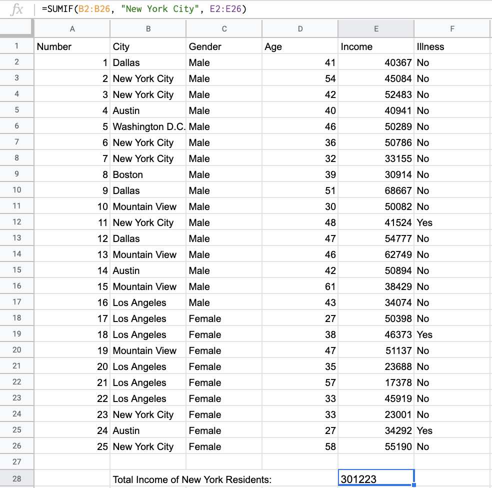
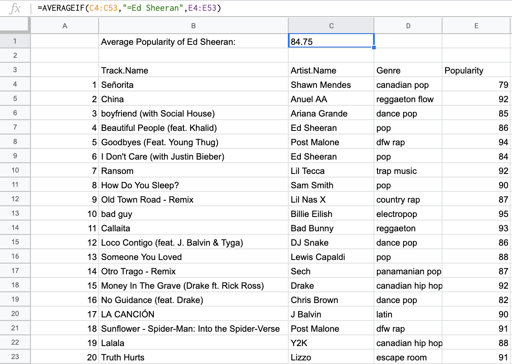
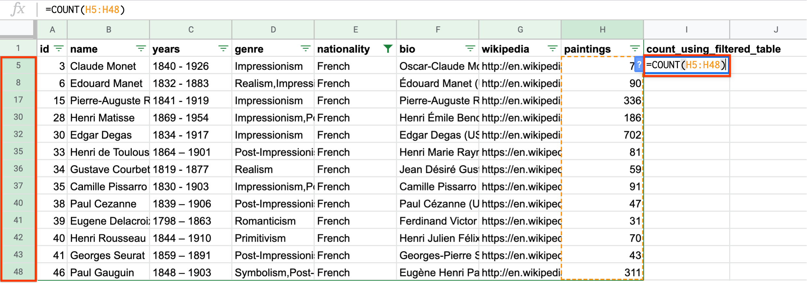
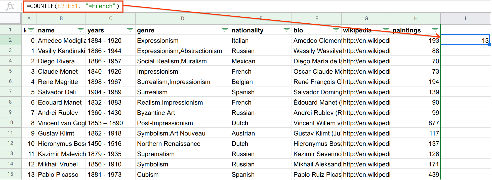
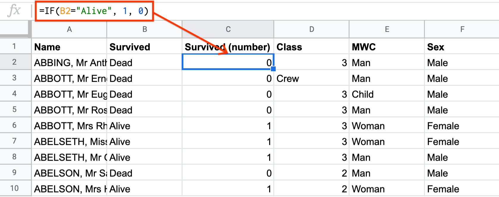

<!-- Copyright (C)  Google, Runestone Interactive LLC
  This work is licensed under the Creative Commons Attribution-ShareAlike 4.0
  International License. To view a copy of this license, visit
  http://creativecommons.org/licenses/by-sa/4.0/. -->

Grouping Data
=============

Filtering data allows you to subset data to a set of rows based on some
conditions. This allows for analysis on that subset of data. Finding
summary statistics for a specific group of observations is called
**grouping**. For example, if you have income data for the entire USA
but want to find the mean income just for California, you would group
the data by state.

Grouping can be done in Sheets using one of three "conditional summary"
functions.

#### Grouping Functions in Sheets

**The COUNTIF function counts the number of cells that satisfy a
condition.** The syntax looks like
`=COUNTIF(cell range to be filtered, filter condition)`.

Earlier in the introduction you saw an example of the `COUNTIF` function
used on a table of standard information about people. That example
utilizes the formula `=COUNTIF(B1:B26, “=Los Angeles”)`. This counts the
number of cells in the range B1:B26 that match the word "Los Angeles".
The **cell range to be filtered** is `B1:B26`, and the **filter
condition** is `“=Los Angeles”`.



**The SUMIF function sums the values of cells that satisfy a
condition.** The syntax looks like
`=SUMIF(cell range to be filtered, filter condition, cell range to be summed)`.

Given the same table of standard information about people, you can find
the total income of those from New York City. Consider the formula
`=SUMIF(B2:B26, "=New York City", E2:E26)`. This sums the values in the
cells `E2:E26`, but only using rows for which the cell in that row in
column B matches the word \"New York City\". The **cell range** to be
filtered is `B2:B26`, the **filter condition** is `“=New York City”`,
and the **cell range to be summed** is `E2:E26`.

Pictured is a screenshot of part of the dataset in Sheets with the
grouping function `SUMIF`.



**The AVERAGEIF function finds the mean of cells that satisfy a
condition.** The syntax looks like
`=AVERAGEIF(cell range to be filtered, filter condition, cell range to be averaged)`.

Given a table of [the top 50 songs on Spotify in
2019](https://www.kaggle.com/leonardopena/top50spotify2019/data), you
can calculate the mean popularity of songs by a certain artist. For
example, consider the formula
`=AVERAGEIF(C4:C53, "=Ed Sheeran", E4:E53)`. This finds the mean of
cells in the range `E4:E53`, but only using rows for which the cell in
that row in column C matches the word \"Ed Sheeran.\" The **cell range**
to be filtered is `C4:C53`, the **filter condition** is `“=Ed Sheeran”`,
and the **cell range to be averaged** is `E4:E53`.



Note that for `SUMIF` and `AVERAGEIF`, if you want to sum or average the
rows in column B or C themselves, you can enter `B2:B26` or `C2:C53` as
the third argument or leave the third argument empty.

Example: Painters
-----------------

Grouping functions are most useful when finding summary statistics for a
specific group. Consider the painters dataset, one last time. Suppose
you want to count the number of French painters in this dataset, and
find the total number of paintings made by those painters. This can be
done using filtering or using grouping.

Create a filter to limit the dataset to only French painters. (For this
example, assume "French" means the only nationality is French.) Copy the
filtered table to a new sheet.

### Fill in the blank

1. Use `COUNT` on the filtered table to find the number of French painters.

2. Use `SUM` on the filtered table to find the number of paintings by
French painters.

**Why was it necessary to copy-paste the filtered data to new rows?**
Cell ranges do not behave well in filtered tables. This is best
illustrated via an example. Consider the filter applied above, to limit
the painters dataset to French painters.



Notice that when trying to count the number of rows, selecting the cells
selects all cells between the first and the last, not just the filtered
cells. Note that the selected range is
`H5:H48`. While there are only 13 filtered rows, the range selects all
rows between 5 and 48. This returns a count of 44 French artists, which
is incorrect. The same is true for cell ranges when using `SUM`and`AVERAGE`.
Instead of copy-pasting the filtered table to a new sheet and then using summary
functions, you can just use grouping functions. For example, to count the number
of French painters, you can use`COUNTIF`. The range to be counted is the
“nationality” column, and the column condition checks whether the value is “French”.

    
   
### Fill in the blank
   
3. Use`SUMIF`to find the number of paintings by French painters.
    
Note that if you wanted to use the more general definition of “French” (any painter who has French as one of their nationalities), you would need to use a different filter condition. In general, the filter condition for checking if "word" appears anywhere in the text looks like`\"*word*\"` . [This forum discussion goes into more detail](https://stackoverflow.com/questions/17152704/google-spreadsheet-count-if-contains-a-string). This can apply to any grouping function.  Use grouping functions ( ``COUNTIF`,`SUMIF`,`AVERAGEIF`` ) when answering the following questions.  

### Fill in the blank

4. How many Italian (only nationality is Italian) painters are in the list?
 
5. What is the mean number of paintings by Italian painters? (Round your answer  
to the nearest whole number.)

### Multiple choice
   
6. Which genre produced more paintings: impressionism or romanticism? (You may   simplify this by only looking at painters whose only genre is impressionism   or romanticism.)     
   
**A.** Impressionism
   
**B.** Romanticism
   
### Fill in the blank
   
7. How many painters were associated with multiple genres? (Hint: Look for    painters whose "genre" field contains a comma.) 
   
Example: Titanic
----------------  
   
The [Titanic](https://en.wikipedia.org/wiki/RMS_Titanic) was a passenger ship
that sank on its journey from Southampton (England) to New York (USA) in 1912,
[killing over 1,500 people](https://en.wikipedia.org/wiki/Passengers_of_the_RMS_Titanic).
This example uses passenger data from the tragedy. Each row records a passenger on the ship.
The purpose of this example is to find out whether some groups, for example, women and
children who had priority access to life rafts in case of emergency, had a higher survival
rate than others. For example, did women and children have a higher survival rate than men?
This can be done very conveniently using grouping functions.  In its raw state, the survival
of each passenger is encoded as “Dead” or “Alive” in column B. These words are hard to deal
with numerically, so you should probably first transform these values to numbers.
For example, the following formula maps “Dead” to 0 and “Alive” to 1.
(The example is for cell B2, but it can be copy-pasted for the other rows.)
You can insert a column on the left of column C and use this column for the formula.

```
=IF(B2=“Alive”, 1, 0)
```

  

### Fill in the blank 

8. What is the survival rate on the Titanic? (Give your answers as a    percentage, to two decimal places.)    

This survival rate you just calculated is the overall survival rate for all passengers.
What if you want to know the survival rate just for men, or just for women, or just for children?
To calculate the survival rate just for men, you need to find the mean of column C, but only
if column E is equal to “Man”. This is a perfect use case for ``AVERAGEIF\`\`.

``` {.none}
=AVERAGEIF(E$2:E$2209, "=Man", C$2:C$2209)
```


### Fill in the blank

9. What is the survival rate for women? (Give your answers as a percentage,
to two decimal places.)

10. What is the survival rate for children? (Give your answers as a
percentage, to two decimal places.)

### Short answer

- Compare the survival rate across the classes: Crew, Class 3, Class 2,
Class 1. Is this in line with what you expected?

<details>
<summary>Answers</summary>
<br>
 
1. 13
 
2. 2120
 
3. 2120

4. 8

5. 136

6. Impressionism

7. 12

8. 32.25%

9. 75.69%

10. 51.61%

</details>