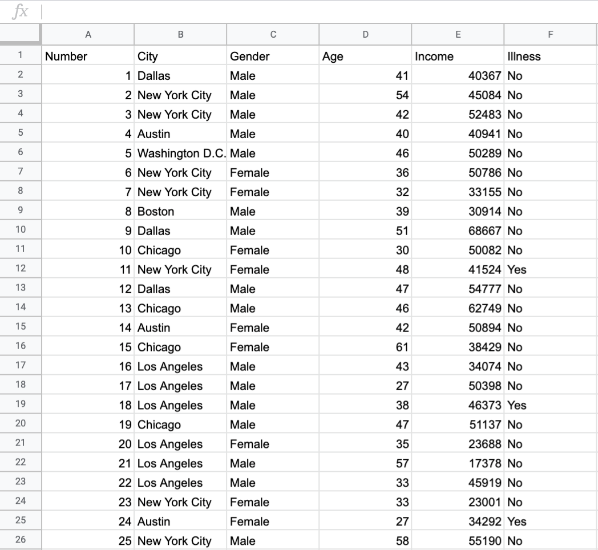
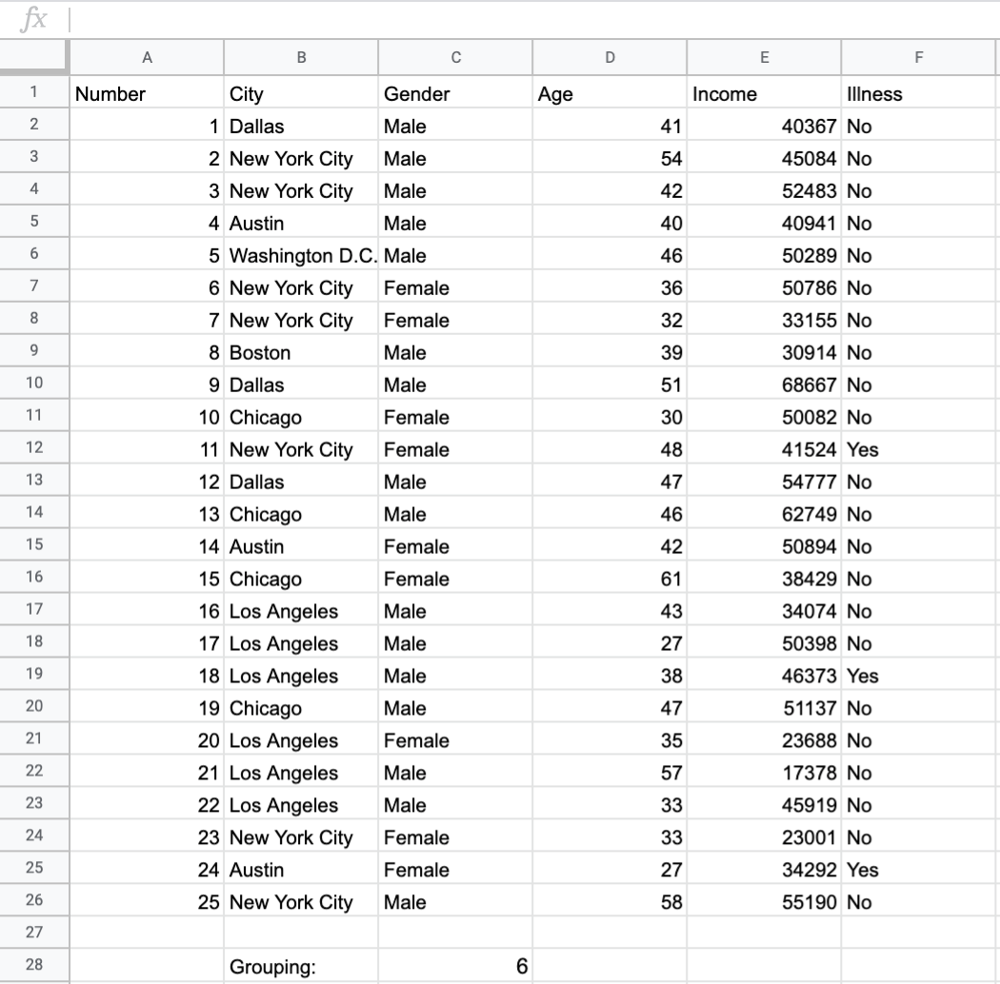

<!-- Copyright (C)  Google, Runestone Interactive LLC
  This work is licensed under the Creative Commons Attribution-ShareAlike 4.0
  International License. To view a copy of this license, visit
  http://creativecommons.org/licenses/by-sa/4.0/. -->

Introduction
============

Now that Sheets is more familiar and you know how it can hold data, you
will learn how Sheets can also be used to organize that data. Sheets has
functions that allow you to **filter** as well as **group** data. For
example, if you had the table below you could use filtering and grouping
to more easily display certain data.

Above is a table with some standard information collected from a group
of 23 people. This data is fictional. Below is the same data from this
table after filtering and grouping are separately applied.

This is an example of **filtering** the data to only see rows of people
whose city is Los Angeles.

This is an example of **grouping** the data to count the number of
people in this dataset who are from Los Angeles.

Don\'t worry if this is confusing. These examples are meant to help you
become more familiar with applications of filtering and grouping on a
data set.
