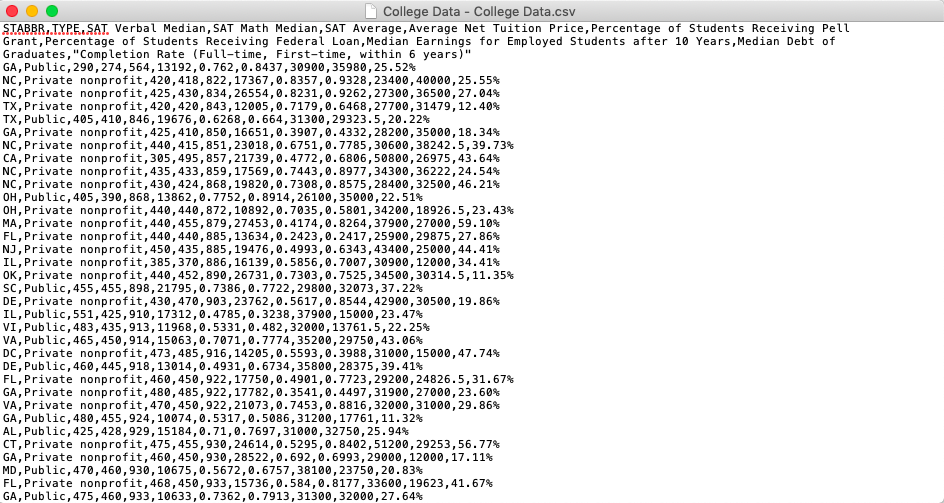
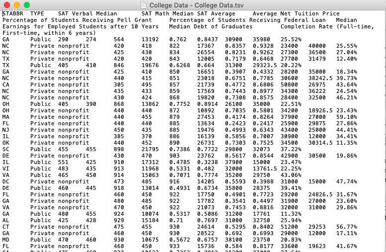
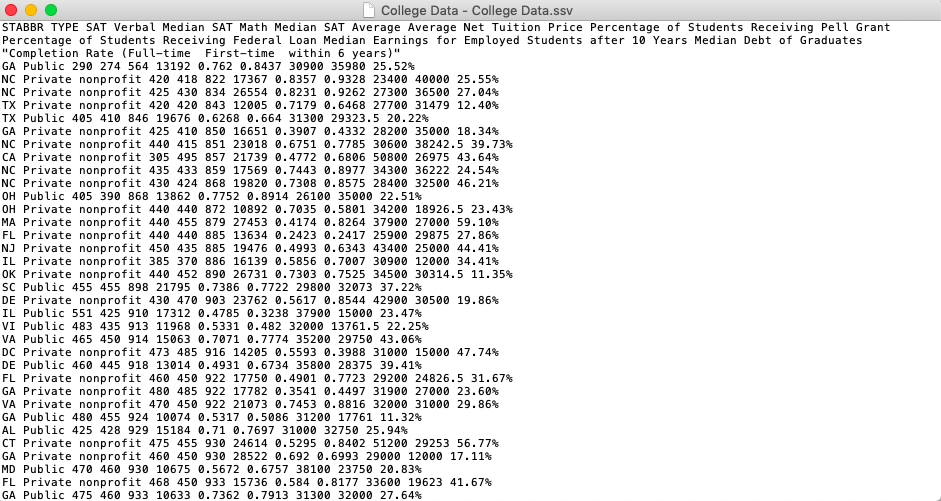
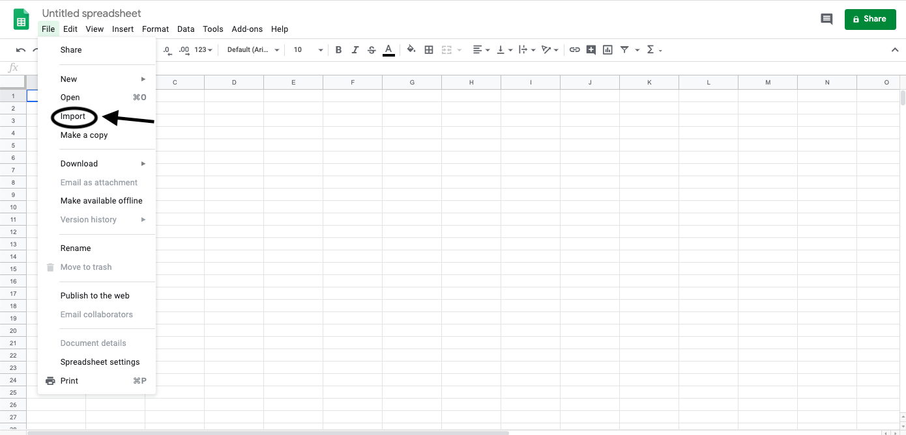
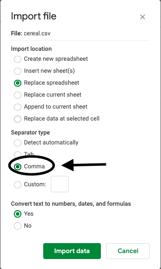
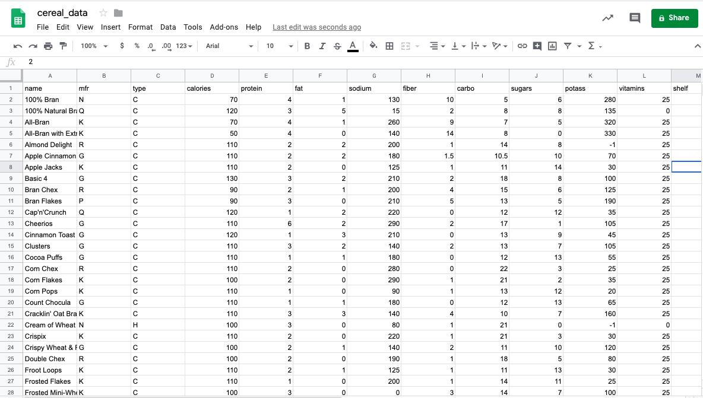

<!-- Copyright (C)  Google, Runestone Interactive LLC
  This work is licensed under the Creative Commons Attribution-ShareAlike 4.0
  International License. To view a copy of this license, visit
  http://creativecommons.org/licenses/by-sa/4.0/. -->

Importing Data
==============

Up to this point, you have been dealing with data entirely within
Sheets. However, when you start tackling problems on real-world
datasets, you will likely have to fetch the data yourself. Most of the
data you will deal with in this section is stored in online repositories
such as GitHub or Google Drive.

The most common file format that is used with spreadsheets is a
**delimited file**, in which:

-   Each row is separated by a new line.
-   Each column is separated by a delimiter/separator, which can be any
    character.

The most common separators are listed below.

1.  Comma: Files using "," as the separator are called "comma-separated
    value" (csv) files.

    

2.  Tab: Files using tab as the separator are called "tab-separated
    value" (tsv) files.

    

3.  Space: These exist but are significantly less common.

    

In general, any character can be a delimiter, but it is extremely
uncommon to use a delimiter that is not a comma, tab, or space.

Luckily, sheets makes importing data relatively straightforward. [Here
is a dataset on 80 different brands of
cereal](https://www.kaggle.com/crawford/80-cereals), that you can
download to your computer and then work within Sheets.

Import this data into Sheets using the following instructions.

1.  In a new spreadsheet, click "File \> Import".

    

    You can either select a file from Google Drive or navigate to
    "Upload", where you can drag and drop a file or select a local file.

    

2.  After selecting a file, you will have to choose from a list of
    options. For the most part, Sheets is pretty good at automatically
    parsing the input file and knowing which separator to use. However,
    since you know this data is comma-separated, it is good practice to
    set "Separator type" to "Comma". You can choose the "Import
    location" that suits you best.

    

3.  When you click "Import data", you should see the entire dataset.

    
