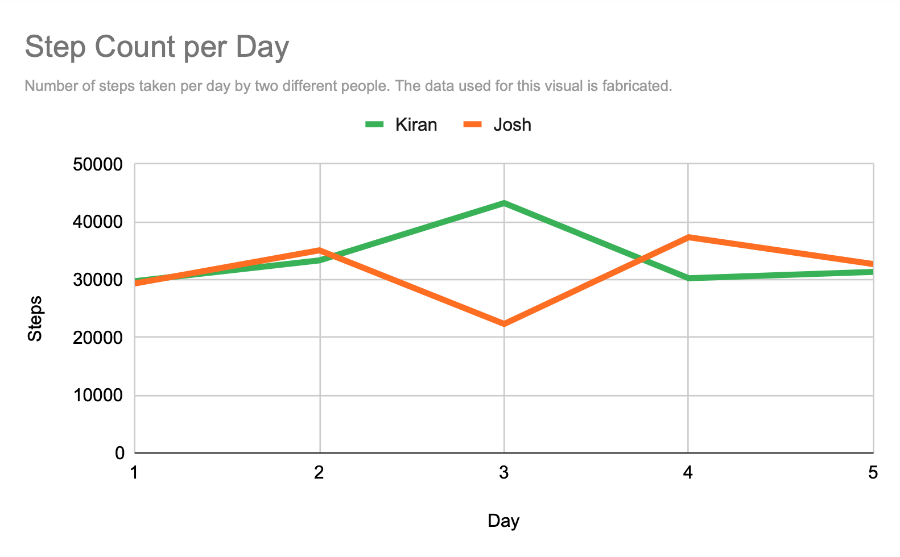
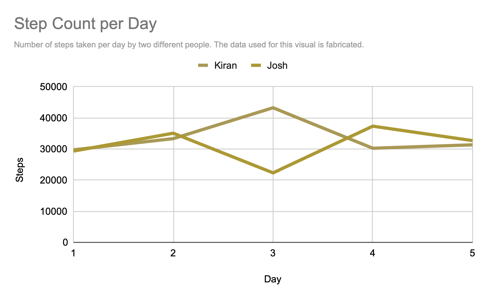

Checklist for Creating Visualizations
=====================================

Making Accessible Visualizations
--------------------------------

When creating visualizations, it is important to create content that is
both **physically accessible** and **understandable** to all. [More than
1 billion people have some form of
disability](https://www.who.int/en/news-room/fact-sheets/detail/disability-and-health),
so you need to ensure that you are not excluding anyone when creating a
visualization.

For example, look at the following example of a chart.

{.align-center}

However, someone who is color-blind may see the graph as shown below,
which has been [generated using this color-blindness
simulator](https://www.color-blindness.com/coblis-color-blindness-simulator/).
As you can see, it is more difficult to read.

{.align-center}

How might you ensure that a color-blind person can understand your
visualization. How about if a person was dyslexic? [This article
identifies some key considerations for accessible data
visualizations.](http://www.storytellingwithdata.com/blog/2018/6/26/accessible-data-viz-is-better-data-viz)

In addition, some other aspects of visualization to think about include
language, color, size. Look at your choices and ask:

-   Is this the simplest way to express this information?
-   How simple/complicated should your visualization be, depending on
    the technical understanding of your audience?

Keep these questions in mind so that your visualizations are clear for
all.

What should I keep in mind when creating a visualization?
---------------------------------------------------------

Now that you have been able to examine some existing visualizations,
it\'s time for you to make your own! There are several choices for you
to consider when making visualizations that are accessible for viewers.
Here is a checklist for you to reference when making a visualization.
More details are listed below the checklist.

{.align-center}

1.  **Why** are you making this visualization? What **point** do you
    intend to make with the visualization?
    -   It is important to keep in mind what facts and/or opinions you
        are trying to convey with your visualization.
2.  **What** is the **content** of the visualization?
    -   What data will you need?
    -   What aspects of the data will you need to showcase?
3.  **Who** is the **audience** of the visualization?
    -   The audience of your visualization will impact everything in the
        visualization, from the type of graphic to the style of language
        used.
    -   It is also crucial to know how data-competent your audience is.
        You want everyone who sees this visualization to understand it.
4.  **Which types** of visualization do you plan to use?
    -   The "type" of visualization indicates the format, e.g. Is it a
        table? Is it a pie chart?
    -   Try out different formats of charts. How do you know a specific
        type of visualization is the best unless you try others?
