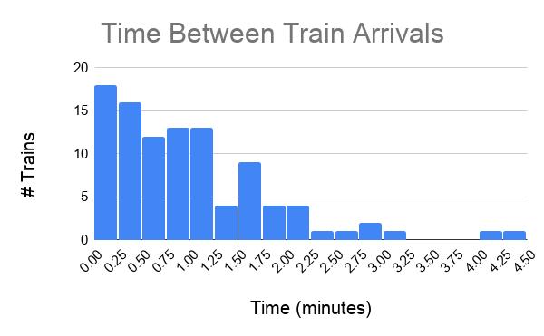
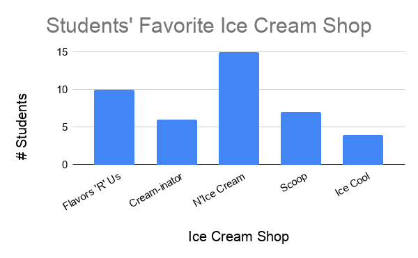
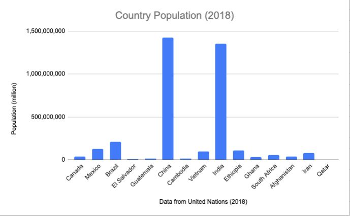
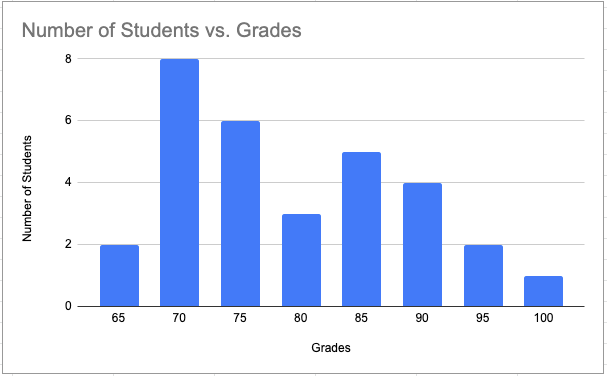
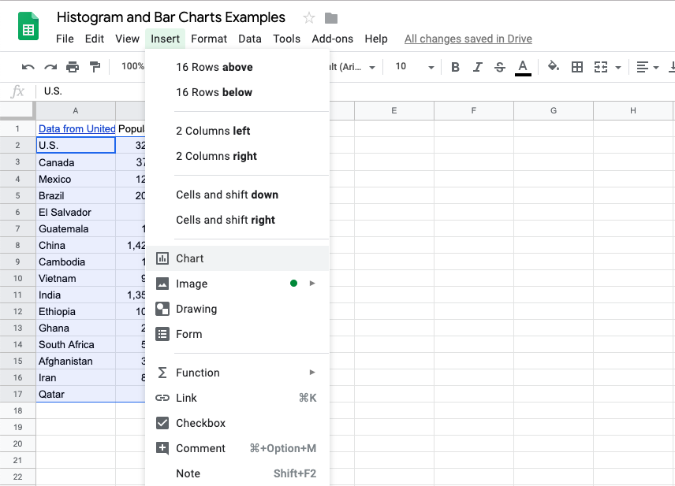

<!-- Copyright (C)  Google, Runestone Interactive LLC
  This work is licensed under the Creative Commons Attribution-ShareAlike 4.0
  International License. To view a copy of this license, visit
  http://creativecommons.org/licenses/by-sa/4.0/. -->

Histograms and Bar Charts
=========================

Some of the most commonly used visualizations are histograms and bar
charts. These are the types of graphs with vertical bars of different
heights. An example of each is below. (The histogram is the first, the
bar chart is the second.)

Histograms and bar charts are generally used for counting, that is, to
display and compare how many things exist or happen. For example, such a
chart could show:

1.  The human population in different countries (counting people)

2.  The number of people who get different grades in a class (counting
    students)

3.  The frequency of train arrivals at different stations (counting
    trains per unit time), which is shown as the first example above

Note that sometimes bar charts with vertical bars are called column
charts. Choosing between horizontal and vertical bars is largely an
aesthetic choice. [This article goes into more detail about when you
might like to choose one over the
other.](https://www.fusioncharts.com/blog/bar-charts-or-column-charts/)
This textbook will always use vertical bars for consistency. As such,
the terms "column chart" and "bar chart" will be used interchangeably,
and will always refer to a vertical bar chart.

**What is the difference between a histogram and a bar chart?** There is
actually not a whole lot that is different, and in principle you can
consider them to be the same. Both are used to compare counts or
frequencies of an event or occurrence for different values of a
variable. Some textbooks and industries, however, do distinguish between
the two. To understand the full nuance of the difference, it is first
important to understand different types of variables. The nuance of this
difference will be more clear after you learn the different types of
variables in [this section](../sheets_basics/variables.md).

In some cases, the x-axis (horizontal axis) of the graph represents
different **categories**. Each category is a distinct group. Examples of
this are:

-   countries (as in example 1 above)
-   letter grades (as in example 2 above)
-   hair color

In this case, plotting counts or frequencies for the different
categories is called a bar chart. There is always a gap between the
vertical bars, to indicate that the different categories are distinct.

In other cases, the x-axis (horizontal axis) of the graph represents
**bins of numbers**. Each bin represents a specific interval of a number
(for example, one bin might include a range of values between 0 and 10).
Examples of this are:

-   time between train arrivals (as in example 3 above)
-   heights
-   SAT scores

In this case, plotting counts or frequencies for each bin is called a
histogram. There is never a gap between the vertical bars, to indicate
that the value of each bin is directly above or below the value of its
neighbors.

For the two graphs presented earlier in this section:

-   The bar chart is graphing students' favorite ice cream shops.
    -   The variable on the x-axis is "ice cream shop", which is a
        category, not a number.
    -   There are gaps between the bars.
-   The histogram is graphing time between train arrivals.
    -   The variable on the x-axis is in "minutes", which is a number,
        not a category.
    -   There are no gaps between the bars.

### Multiple Choice

1. For which of the following variables would you prefer a histogram over a
bar chart?

**A.**   Marathon completion times

**B.**   Undergraduate major

**C.**   Income

**D.**   Income bracket

Using Sheets
------------

Sheets makes it fairly straightforward to create graphs. The hard part
is choosing the right graph and customizing it to best display your
data.

You can make graphs in Sheets by highlighting the data you want to
visualize, then clicking "Insert \> Chart".

You can then customize this chart in numerous different ways. Below are
just a few important things to keep in mind when creating graphs.

-   Make all text (main title, axis titles, axis labels) big enough to
    read. (There are no hard and fast rules here, but always have
    [accessibility](creating_visualization_checklist.md) at the forefront
    of your mind when creating visualizations.)
-   Choose descriptive titles for the horizontal and vertical axes.
-   Choose the right bin size (width) for histograms.

Sheets distinguishes between column charts, bar charts, and histograms.
Based on the above, be sure to choose the correct graph for your use
case. (It is also recommended to use column charts over bar charts.)

-   The "column chart" option has vertical bars with gap.
-   The "bar chart" option has horizontal bars with gaps. Avoid using
    this one.
-   The "histogram" option has vertical bars with no gaps.

### Short Answer

- What is the appropriate graph for this data? Create the graph in Sheets.

Answers

 
 
1. Marathon completion times (time is always numeric), Income (income is numeric, until it discretized into buckets, like example D)

