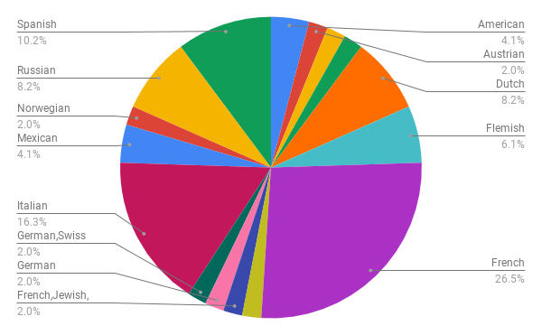
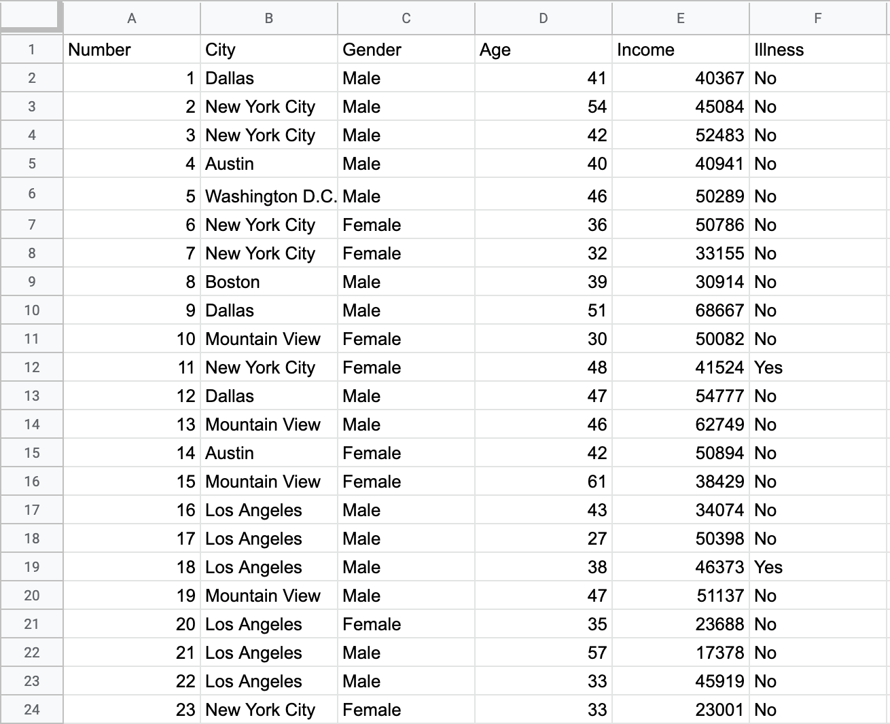
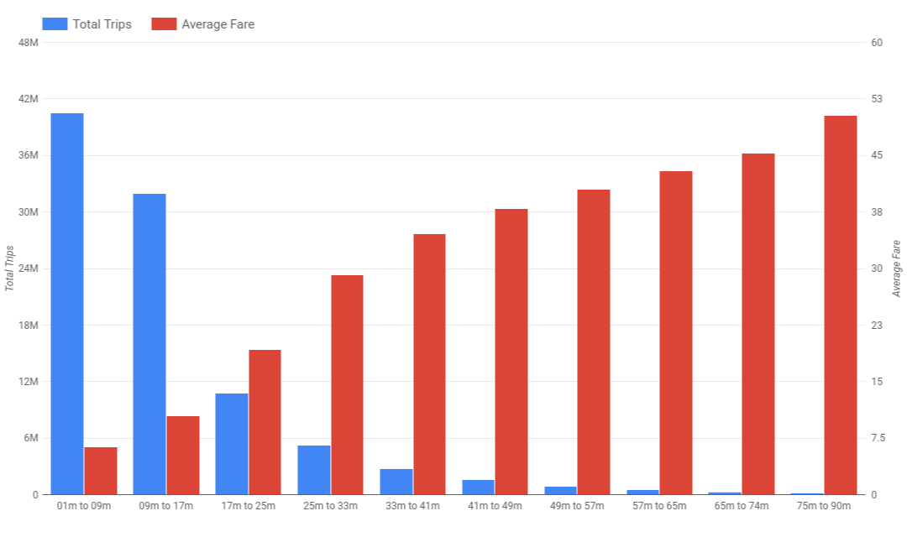

<!-- Copyright (C)  Google, Runestone Interactive LLC
  This work is licensed under the Creative Commons Attribution-ShareAlike 4.0
  International License. To view a copy of this license, visit
  http://creativecommons.org/licenses/by-sa/4.0/. -->

Introduction
============

People often find it easier to learn visually. Colors and patterns can
be easier to interpret than words and numbers. Have you ever read an
article that does not include some form of picture, or graphic, or map?
Visualizations make data easy to access, make articles easy to read, and
make findings easy to interpret.

**A data visualization is any visual representation of data.** Examples
include:

-   Tables
-   Line graphs
-   Maps
-   Pie charts
-   Infographics

In this chapter, you will learn more about when to use different
visualizations and how to ensure that they effectively communicate data
to your audience. To start, take a look at the visualizations below.
While reviewing them, keep in mind what you like about them and what
elements on them guide your understanding of their meaning.

Pie Chart
---------

This pie chart example shows the proportion of the backgrounds for the
most influential artists of their time from different countries.

Table
-----

This table holds standard information about people. Each column contains
data for a different category.

Bar Chart
---------

This figure holds information about the amount of trips and average fare
depending on the duration of taxi rides in Chicago.
