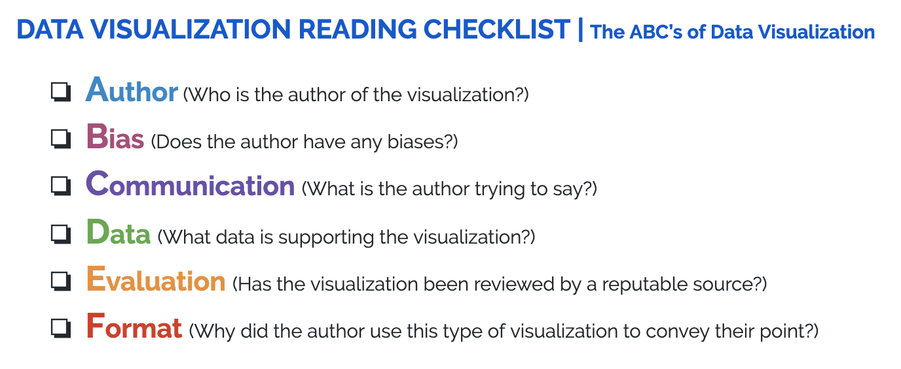

<!-- Copyright (C)  Google, Runestone Interactive LLC
  This work is licensed under the Creative Commons Attribution-ShareAlike 4.0
  International License. To view a copy of this license, visit
  http://creativecommons.org/licenses/by-sa/4.0/. -->

Checklist for Reading Visualizations
====================================

'What should I look for when reading a visualization?'
------------------------------------------------------

When you find a visualization online, it is important to ensure that you
understand where the data is coming from and how this may affect how it
is presented. Being able to interpret visualizations is a fundamental
skill in data science. Like any form of media, a visualization has an
author. As such, it has potential biases, and can be interpreted in
different ways.

Here is a checklist of important things to consider when reading a
visualization. More detailed descriptions of what to look for in a
visualization are listed below the checklist.

1.  Who is the **author** of the visualization?
    -   Is the author a single person, or is the author writing on
        behalf of an organization?
    -   Is the author an experienced statistician and/or writer?
2.  What **biases** might the author have?
    -   Especially if the visualization is on a media platform, it may
        have unconscious or conscious bias. This may include, but is not
        limited to:
        -   political bias
        -   racial bias
        -   product bias (i.e. if the author trying to promote/sell
            something)
3.  What point is the author trying to **communicate** with the
    visualization?
    -   A visualization is an author's choice of medium to convey facts
        and/or opinions.
    -   What are these core facts and/or opinions?
4.  What **data** is backing the visualization?
    -   It is *crucial* to know what data is used to make the
        visualization. For example:
        -   **Location**: Is it global data, or is it a specific
            country/state/region?
        -   **Demographic**: Is it a subset of people, specified by
            something like (but not limited to) race/gender/age?
        -   **Sampling**: Does it include *all* of the people in a given
            population, or just a sample? Is the sample random? How was
            the sample chosen? (For example, if you were conducting a
            study of students at your college, your population of
            interest would be all students at the college, while a
            sample would be just the students in your dorm.)
5.  How rigorously has the visualization (or the article in which the
    visualization appears) been reviewed and **evaluated**?
    -   For example, if the visualization appears in *The New York
        Times* it has likely been thoroughly reviewed, whereas if the
        visualization is part of a personal blog it may not have been.
6.  Why has the author chosen this **format** of visualization?
    -   What format does the visualization use? Is it a table? Is it a
        pie chart?
    -   What does this type of visualization do to accentuate their
        point?

### Short Answer

- Find an example of a data visualization online. Follow the checklist
above with your chosen visualization.

