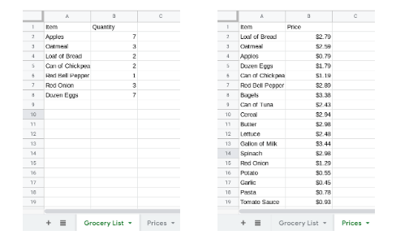
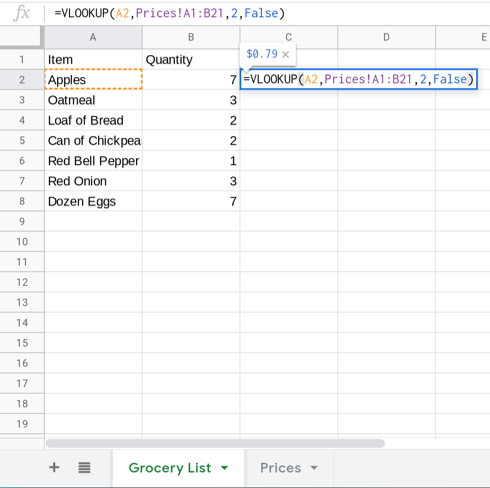
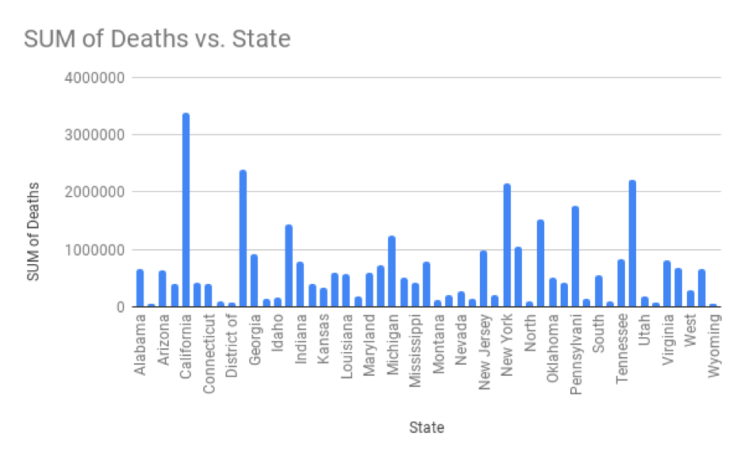
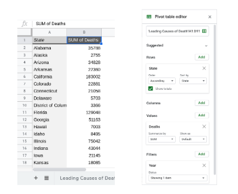
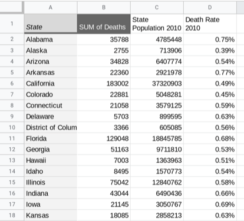
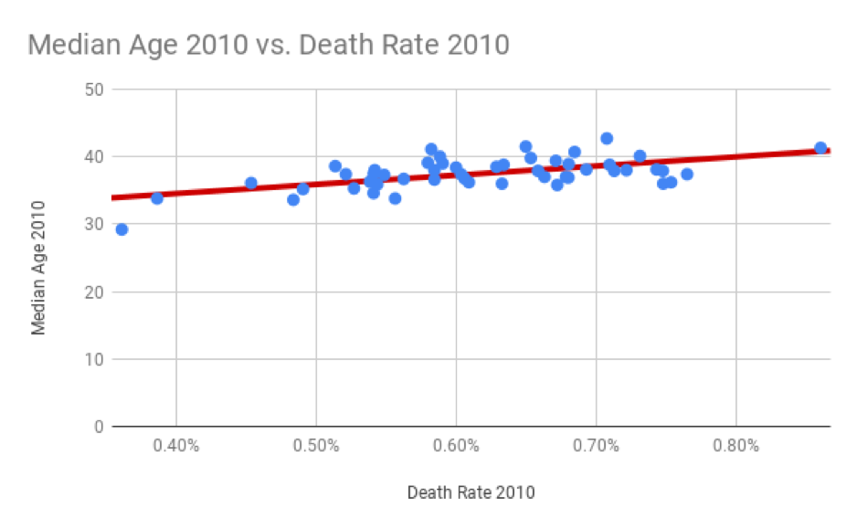
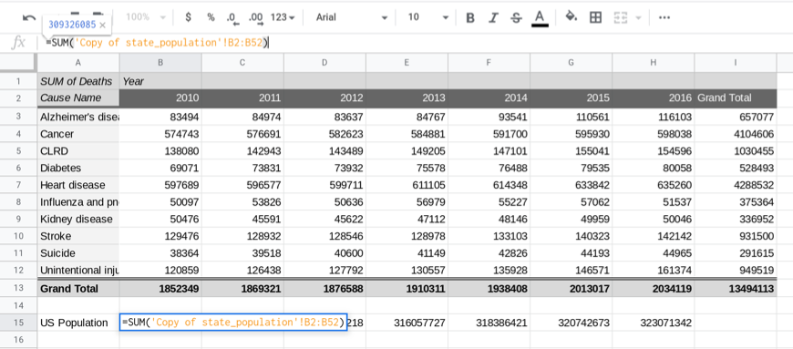
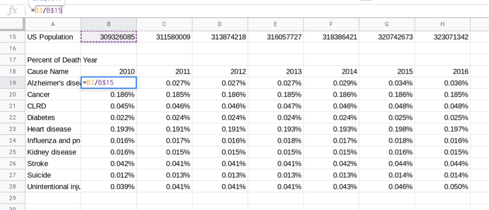
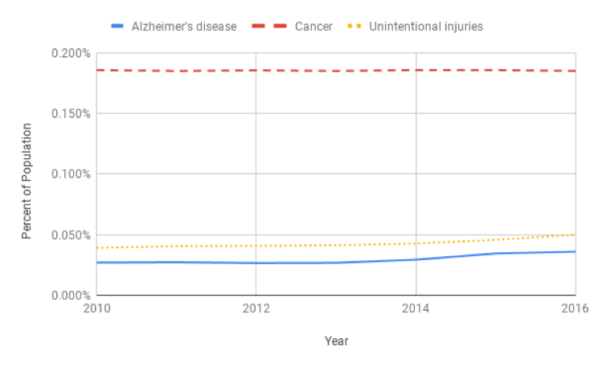

<!-- Copyright (C)  Google, Runestone Interactive LLC
  This work is licensed under the Creative Commons Attribution-ShareAlike 4.0
  International License. To view a copy of this license, visit
  http://creativecommons.org/licenses/by-sa/4.0/. -->

Joining Data
============

You might often find yourself in a situation where the data you need
isn't all in the same table. While the previous examples have all been a
single sheet, sometimes the variables you want to compare are in several
different sheets or files. In order to analyze the relationships between
these variables, first you need to bring them together.

Example: Grocery List
---------------------

Suppose you have [a file with two
sheets](https://docs.google.com/spreadsheets/d/1QlVMi3EYcJg4o8aKuK1IJZXrM3HGQFAQu262lAz1amg/edit?usp=sharing):
a grocery list, and a list of prices of various items. The grocery list
contains the items you need and the quantity. The prices list has
various items available at the grocery store and their cost. To
calculate the total cost for this grocery trip, you need to join the
cost information to the grocery list information. While you could copy
the cost of each item over, that would be both tedious and error prone.

Thankfully, there is a function in Sheets that can do this work
automatically.

The *VLOOKUP* function matches elements from one list to the
corresponding values in another. You will use this to add the cost of
each item in your grocery list. *VLOOKUP* takes four values as input:
search\_key, range, index, and is\_sorted.

-   The **search\_key** is the value *VLOOKUP* will try to match. For
    apples, the search\_key will be A2 which contains the text "Apples".
-   The **range** is a table, either in the same sheet or in another
    sheet in the same file, where *VLOOKUP* will look for the
    search\_key. In this case, the table will be in the Prices sheet, in
    the cells A1:B21. To point sheets to another sheet you can either
    navigate to that sheet and select the area with a mouse, or type
    Prices!A1:B21. The exclamation point separates the name of the sheet
    from the location of the cells. (Note: For *VLOOKUP* to work
    properly, the seach\_key terms have to be in the first column of the
    range.)
-   The **index** is the number of the column where the output is
    stored. To add the price of each item, *VLOOKUP* needs to return the
    price, which is in the second column. So in this example, the index
    is 2.
-   There are only two options for **is\_sorted**. If the first column
    of the range is sorted alphabetically or numerically, then
    is\_sorted should be True (you could also omit is\_sorted, as the
    default value is True). If the first column of the range is not
    sorted, is\_sorted must be False. The list of items in the Prices
    sheet is not in order, so is\_sorted should be False in this
    example.

In this example, *VLOOKUP* finds that the price of an apple is \$0.79.
Try copying the formula down to the cells C3:C8.

### Multiple choice

1. Why does *VLOOKUP* not work for Loaf of Bread and Dozen Eggs?

**A.**   They aren't listed in the Prices tab.

**B.**    They aren't spelled correctly.

**C.**   The formula changed when it was copied.

**D.**   Those have to be looked up by hand.

Finish the grocery list by completing the following:

-   Correct the formula so that the Grocery List sheet has the prices
    for each item.
-   Multiply the cost per item by the number needed.
-   Sum the costs of for each item to get the total cost of the grocery
    list.

2. What is the total for all the items on this grocery list in the
quantities given?

**A.**   \$40.55

**B.**   \$13.33

**C.**   \$93.31

**D.**   \$20.23

While you could have filled these in by hand, imagine filling that
information out for a grocery list with 100 items. That method is also
more error prone. Another benefit to using *VLOOKUP* is that, if the
price changes, you can update the prices tab and the subtotal will
automatically be recalculated.

To get a sense of how easy it is to recalculate the total in Sheets when
a single item\'s price changes, answer the following question:

### Multiple choice

3. If apples are on sale for 39 cents each, what would the new subtotal be?

**A.**   \$37.75

**B.**   \$15.77

**C.**   \$32.64

**D.**   \$25.22

Example: Death Rate by State
----------------------------

Earlier, you considered a non-profit that works to improve the life
expectancy of Americans, and you helped them find the leading causes of
deaths in the USA. Now your nonprofit wants to know how each state
stacks up against the others, in terms of causes of death. For example,
are some states heart-healthier than others?

To begin to answer these questions, first make a pivot table and a bar
chart to tell you which states have the most deaths.

The bar chart above shows the number of deaths for each state. Not every
state name is labelled, but the four tallest bars correspond to
California, Florida, New York and Texas. However, just looking at raw
numbers may be misleading: a state might have more deaths just because
it has a large population. To compare states relatively instead of
absolutely, you need to convert the values to the percentage of people
who died in each state. This percentage, called the death rate, is the
result of dividing the number of deaths in the state by the state
population for a specific year.

The
[state\_population.csv](https://docs.google.com/spreadsheets/d/1Nnfcs8Um2dZScXMXWErS8VDZwKLAjDDhAMvfQ0mpGFQ/edit?usp=sharing)
file has the population of each state from 2010 to 2018. Copy that sheet
into a new sheet in your NCHS file. To calculate the death rate, you
must specify a year so that the population of that year can be matched
to the deaths from that year. To match the table of deaths to the year
selected, add another filter to the pivot table of deaths by state
restricting to the year 2010.

Add a column, using *VLOOKUP*, to display the state population in column
C next to the death total for each state. The search\_key will be the
state name, the range will be the table of state populations, the index
will be 2 because the 2010 populations are in the second column, and
is\_sorted will be True as the state names are in alphabetical order.

After filling in the column of state populations, add a column for the
death rate by dividing the total number of deaths by the state
population. (It makes it more understandable if you format this column
as a percentage.)

### Multiple choice

4. Which state has the highest death rate?

**A.**   Arkansas
    
**B.**   New York
    
**C.**   West Virginia

**D.**   Texas

5. What is the average death rate?

**A.**   .97%

**B.**   .58%

**C.**   .49%

**D.**   .62%

There is a pretty big variation in death rates by state. One possible
reason for this difference is the typical age in each state. States with
younger populations should have a lower death rate than states with
older populations. The file
[age\_by\_state.csv](https://docs.google.com/spreadsheets/d/1YWB6hKAFpBEjj8jZ4N3K_N2cULK0cd1eQdPV8BIPi2M/edit?usp=sharing)
has the median age for each state from 2010. Add a new column for median
state age using *VLOOKUP*.

### Short answer

- What is the correlation between the death rate and the median age?

The scatter plot of death rate and median age shows that states with
younger populations *do* tend to have a lower death rate than states
with older populations. Of course, since correlation does not imply
causation, that doesn't necessarily mean that if you move to Alaska,
you'll turn younger or live longer.

### Short answer

- Write a summary of this finding that you can send out to your teammates.
Keep it brief and non-technical, but refer to important findings.

Answering questions relating different variables and trying to explain
variation often involves bringing together information from different
sources. *VLOOKUP* is a great tool for joining data, but it's not the
only one. In the next few weeks of this course you'll learn about other
ways to join data that are more flexible and that work for much larger
datasets.

Example: Cause of Death over Time
---------------------------------

One possible explanation for the increase in the number of deaths due to
cancer, unintended injuries and Alzheimer's disease, is that the
population of the USA has increased over the same time period. To rule
out population growth as a cause of the increase, you need to look at
the percentage of the population that died from each cause over time,
rather than the raw numbers of deaths.

Construct a pivot table with "Cause Name" for rows and "Year" for
columns. The values are the sums of the number of deaths for each group.
As the state population data starts in 2010, add a filter to only
display the years 2010 to 2016. To convert the total number of deaths to
percentages, divide the number of deaths by the population for each
year.

Add a row below showing the population for each year from 2010 to 2016.
(There are several ways to do this. One possible solution uses the sum
of each column of state populations to get the population for each
year.)

To graph the percentage for each cause of death, construct a table below
(or in another sheet) with the same row and column labels. The value of
each cell in this table will be the number of deaths for that cause and
year divided by the population for that year.

Select the data in this table, A18:H28, and insert a line graph showing
how these percentages have changed over time. The graph below has been
restricted to cancer, Alzheimer's disease and unintentional injury for
clarity. The line types have also been modified to be dashed in
different ways.

Though the cancer rate is consistent over time, the rates for
Alzheimer's disease and unintentional injury have increased between 2010
and 2016. The Center for Disease Control and Prevention [tracks these
changes](https://www.cdc.gov/features/alzheimers-disease-deaths/index.html)
and studies [the causes of these
increases](https://www.cdc.gov/nchs/products/databriefs/db343.htm) very
closely. The CDC's research suggests that the number of Alzheimer's
related deaths has been increasing because the US population is getting
older and Alzheimer's is a disease that mostly affects older adults.
Additionally, there has been an increase in physicians recording
Alzheimer's as the cause of death. The rate of unintentional injury has
also increased, due to increases in fatal car accidents, drug overdose
deaths, and fatal falls.

Answers

 
 
1. C. The formula changed when it was copied. The range changed when the formula was copied down. 
    Rather than change it by hand in each cell, this is a great time to use absolute references.
 
2. A. \$40.55
 
3. A. \$37.75

4. C. West Virginia

5. D. .62%

