<!-- Copyright (C)  Google, Runestone Interactive LLC
  This work is licensed under the Creative Commons Attribution-ShareAlike 4.0
  International License. To view a copy of this license, visit
  http://creativecommons.org/licenses/by-sa/4.0/. -->

Pivot Tables
============

Tables that show the average or total for different groups are often
very helpful. Suppose some coworkers at a local company aren't sure if
[the hours for which they are each scheduled have been assigned
fairly](https://docs.google.com/spreadsheets/d/1wJlGc0z1_LaVy4NccEN65frFBU5grnQ5hCJ-iKmskSc/edit?usp=sharing).
A table showing each employee, the hours they had been assigned and how
often they opened or closed the business could be used to see if there
were big differences in assignments, and decide if those assignments
were fair.

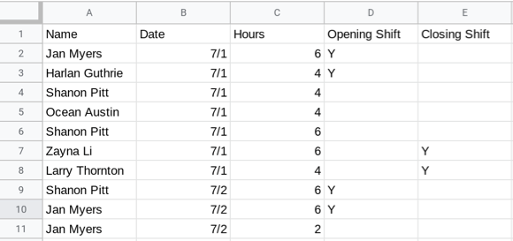

A **pivot table** is a table that allows you to pull relevant summary
statistics from a dataset. You could use AVERAGEIF, SUMIF and COUNTIF to
make the table, but sheets has a built in tool to create a pivot table
that automates this process without having to type out all the formulas.

Start by selecting the data you'd like to use. Then navigate to the
"Data" menu, and select "Pivot table". You can place the new pivot table
in a new sheet or an existing sheet.

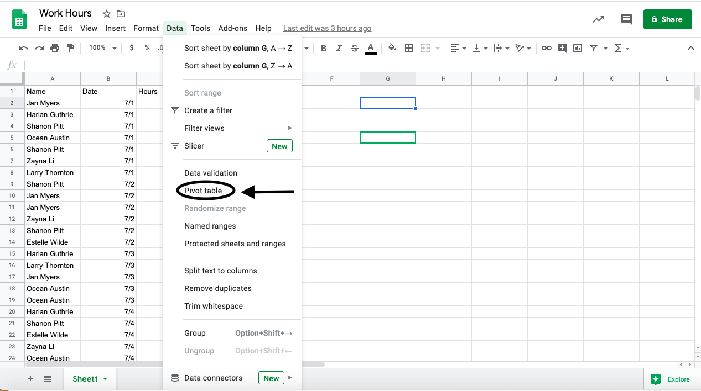

The pivot table editor, which opens on the right, has sections for
adding rows, columns, values, and filters.

-   Adding variables to **rows** or **columns** creates groupings based
    on that variable, displayed either as rows or columns of the pivot
    table. For example, when you select "Name" as a variable under rows,
    the pivot table will have one row for each of the employees at the
    company.

-   Adding a variable to **values** populates the cells of the table.

    -   If you want the total number of hours each employee at the
        company was assigned, select the value "Hours" and summarize by
        sum. This will add the total number of hours each employee was
        assigned to the table.

    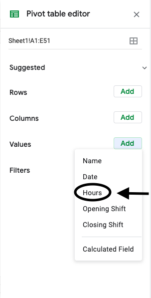

    -   If you want the total number of opening shifts each employee at
        the company was assigned, select the value "Opening Shift" and
        summarize by count. This will add the number of opening shifts
        each employee was assigned to the table as an additional column.

    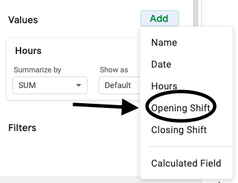

    Repeating this process with "Closing Shift" will add a column
    showing the number of closing shifts for each employee.

-   Adding a variable to **filters** subsets the data before the pivot
    table is constructed. For example, a filter can be added on the
    "Date" variable for only the days July 4 - July 6.

The resulting pivot table would have the total hours, opening and
closing shift for only those three days.

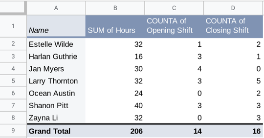

1. Who was assigned the most opening shifts?

**A.** Jan Myers

**B.** Larry Thornton

**C.** Harlan Guthrie

2. Who was assigned the smallest number of hours?

**A.** Harlan Guthrie

**B.** Jan Myers

**C.** Zayna Li

### Short answer

- What evidence from the table would support the employees'
claim that the assignments have not been assigned fairly?

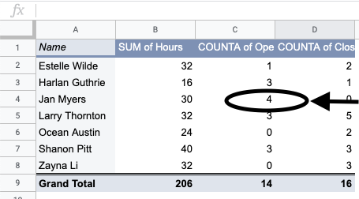

Within a pivot table, double clicking on any value in the table will
create a new sheet with the subset of data from that entry in the table.
For example, double clicking on the value 4 in cell C4 in the table
above creates the sheet below. You can use this subset to look at Jan's
assignments, and ask or answer questions about Jan specifically. This is
also a great way to investigate interesting values or patterns in a
pivot table.

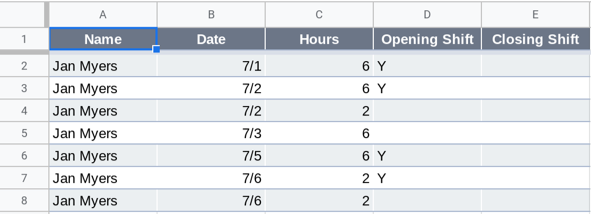

Example: National Center for Health Statistics
----------------------------------------------

For this example, consider a non-profit organization that works to
improve the life expectancy of Americans. You have access to data from
The National Center for Health Statistics (NCHS), which is a branch of
the Center for Disease Control, that provides statistical information
about the health of American people. [The dataset below presents the
number of deaths for the ten leading causes of death in the USA for each
state beginning in
1999.](https://docs.google.com/spreadsheets/d/1fCaevMSqlbq9lGJhqYVp8f_UWcKV4mCA5q81YJsQ0M8/edit?usp=sharing)

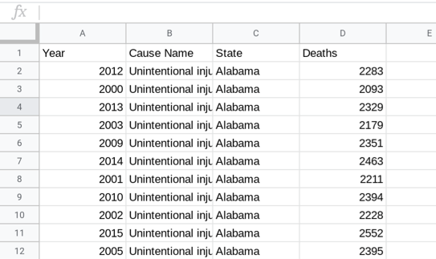

### Fill in the blank

3. How many people died from cancer in Nevada in 2007?

You are working on a project for your nonprofit to try to find the
leading causes of death in the USA, in order to target possible areas of
improvement for healthcare and death prevention. This can be done given
the NCHS dataset above.

First, construct a pivot table with rows from the variable "Cause Name".

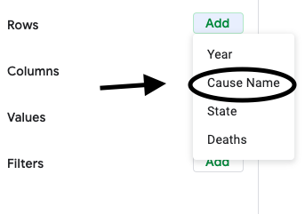

Then add "Deaths" as a value to the pivot table.

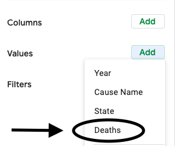

Summarize by *SUM*. (There are many options under summarize. Sum is the
most useful for this context, but average, median, and count are also
commonly used statistics in pivot tables.)

Make sure to have "Grand totals" enabled, so you can see the total
number of deaths.

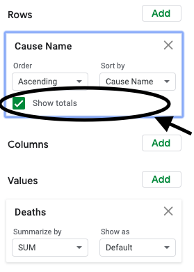

This is what the completed table should look like:

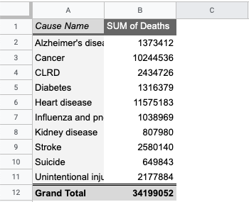

The cause of death responsible for the most deaths in the USA is heart
disease. But what percentage of deaths is this? To calculate the
percentage, you can add a column next to the pivot table that divides
the deaths for each cause by the grand total.(This is an opportunity to
use absolute references to make your life simpler.)

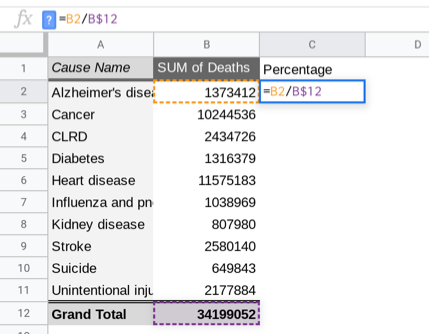

This shows that 33.8% (or over one third!) of deaths in the USA are due
to heart disease. This is astonishingly high, and shows that efforts
towards reducing heart disease or ameliorating symptoms due to heart
disease is the highest priority for the nonprofit.

### Fill in the blank

4. Which cause, out of these top ten, has the smallest share of
deaths?

5. What percent of the deaths represented in this table are due
to stroke?

6. What percentage of the deaths in this dataset do the top two
causes of deaths account for?

In order to present this information to your teammates, it might be
easier to display this information as a chart, rather than a table. A
bar chart, constructed from this pivot table, should make the
information significantly easier to interpret, compared to the raw pivot
table.

To do this, first select the first two coloumns with the relevant data
and select \"Insert \> Chart\".

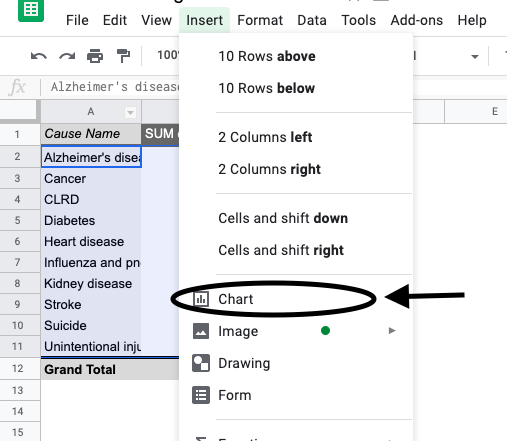

Then in the chart editor select the chart type to be \"Column Chart\".

Make sure that the \"X-Axis\" is set to the cells with the disease names
and the \"Series\" is set to the sum of deaths for each disease.

You should now have the chart below.

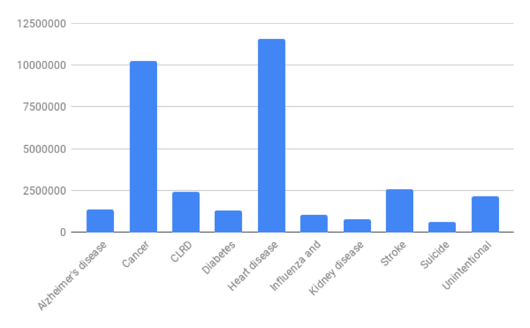

This chart makes it visually clear that heart disease and cancer are the
highest causes of death by a substantial amount.

When you present this graph to your teammates, one of them asks how
these percentages have changed over time. To look into this, add the
variable "Year" as a column. (You'll have to move or delete the
percentage column, or construct a new pivot table.)

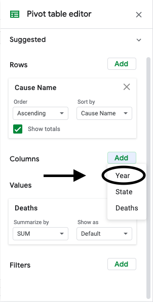

Now you should have the table below.

This table is too large to be interpretable. Visualizing this data in a
chart is much more helpful. Select the range A2:S12 (the pivot table
excluding the first and last rows) and then, under the "Insert" menu,
select "Chart".

Sheets automatically selects a line chart for this data, with "Year"
along the horizontal axis and a line for each cause of death, showing
how each has varied over time. *Line charts* display how one or more
quantitative variables change ver time. To construct a line chart your
dataset must have a time variable. (In this dataset, it is the "Year"
column.)

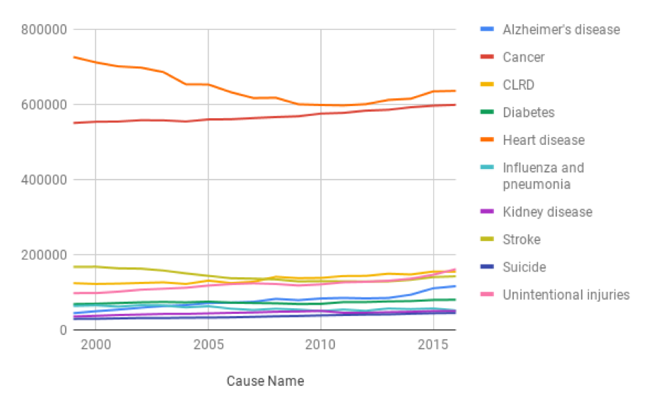

This graph is certainly more interpretable than the table, but it's
still difficult to distinguish the lines towards the bottom. Another
issue is that there are several colors, many of which are hard to
differentiate. Also, if a viewer were colorblind, this graph would be
essentially unreadable. Before presenting this to your teammates, you
need to address these issues. Consider reducing the number of causes
displayed (perhaps to just the most "interesting" causes), and changing
the colors used.

### Fill in the blank

7. What causes of death have had increasing percentages from 1999
to 2016?

8. What causes of death have had decreasing percentages from 1999
to 2016?

It's difficult to see in the graph above, but deaths due to Alzheimer's
disease have been steadily increasing. This change is much easier to see
if Alzheimer's is the only cause of death displayed. Pivot tables allow
for filtering, so you can restrict the table to Alzheimer's related
deaths only.

In the pivot table editor, the last option is "Filter". Add a filter to
"Cause Name."

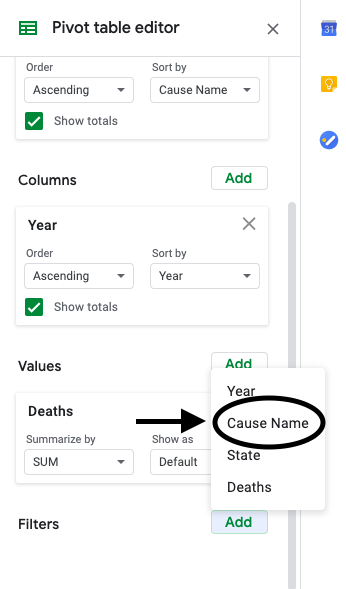

Then under the "Filter by values" option, select only "Alzheimer's
disease". The pivot table and graph will automatically update and show
only Alzheimer's deaths.

### Fill in the blank

9. What is the ratio of Alzheimer's disease deaths in 2016
compared to 1999?

While the raw number of deaths is significantly greater for heart
disease and cancer, the growth of Alzheimer's disease deaths is also
very worrying to your nonprofit. Your manager asks you to investigate
why the deaths are on the rise so dramatically, so you investigate that
more in the next section.

Filtering also works on other values. For example, you can add an
additional filter to only use data from California. First, add a filter
to \"State\".

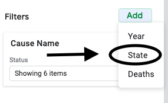

Then under the "Filter by values" option, select only "California".

Below are two graphs for Alzheimer's deaths: on the top just for
California, on the bottom for the entire country.

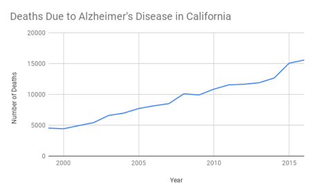

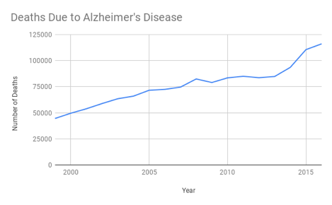

Answers

 
 
1. A. Jan Myers
 
2. A. Harlan Guthrie
 
3. 4331

4. Suicide

5. 7.5%

6. 63 - 64%

7. Alzheimer’s, Cancer, CLRD, Unintentional injuries, Diabetes, Suicide
    Kidney disease

8. Heart disease, Influenza and pneumonia, Stroke

9. 4532 to 15570, (or simplified to 2266:7785)

