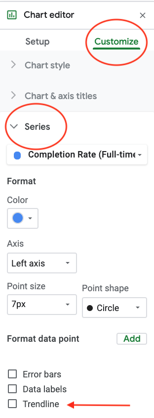
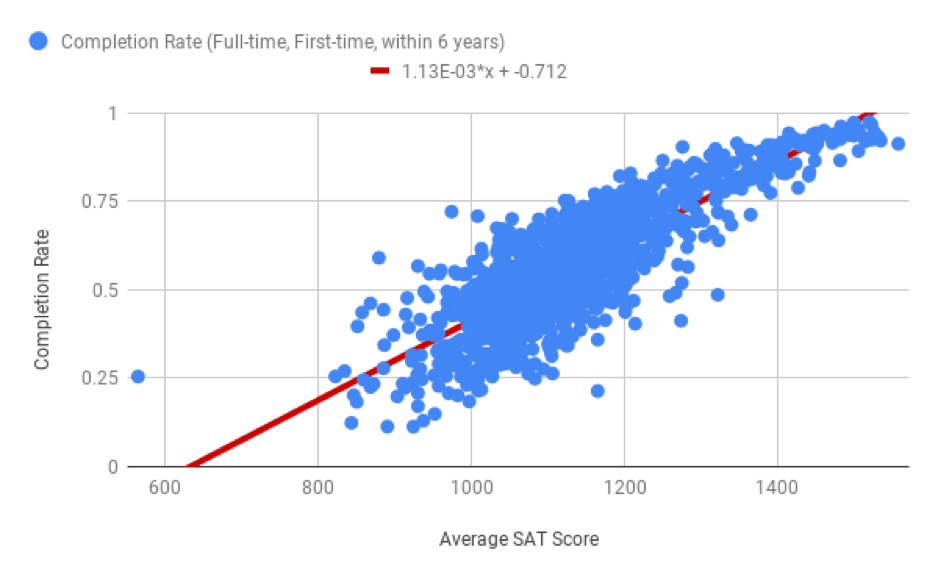

<!-- Copyright (C)  Google, Runestone Interactive LLC
  This work is licensed under the Creative Commons Attribution-ShareAlike 4.0
  International License. To view a copy of this license, visit
  http://creativecommons.org/licenses/by-sa/4.0/. -->

Creating a Line of Best Fit
===========================

In order to analyze a line of best fit for a scatter plot, you will
first need to make one. You can do this in Sheets through an option in
the chart editor. After making a scatter plot, you can add a line of
best fit by opening the chart editor by clicking the three dots in the
top right corner.

Once the chart editor is open, make sure customize is selected. Under
"Series", there is a checkbox to add a trendline. You can change the
color and thickness of the line, display the R2 value, (this is the
same as the coefficient of determination), and display the equation of
the line.

Once you have added a trendline, it will appear on your graph.

Now that there is a trend line and equation of a line on the graph, you
can use this information to analyze data and predict results given your
data. In particular you can use the slope and y-intercept. Don\'t worry
if you don\'t remember how to find this information from the equation of
a line, the next section will guide you through this.
