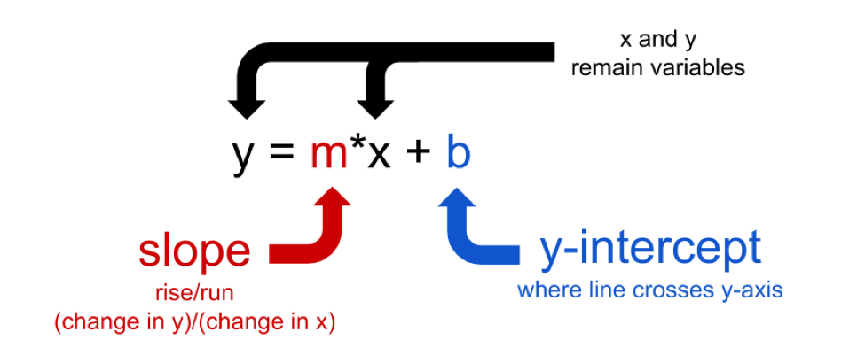
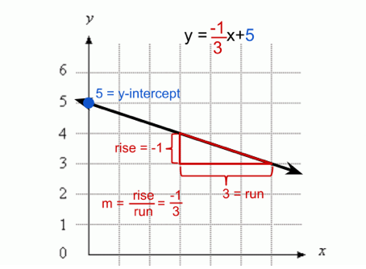
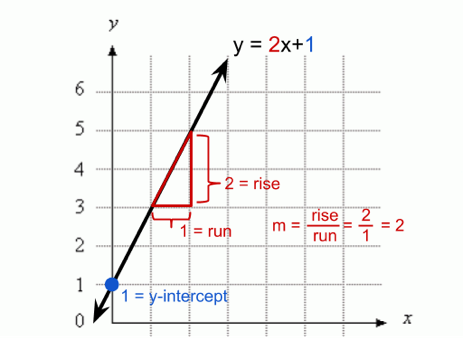

<!-- Copyright (C)  Google, Runestone Interactive LLC
  This work is licensed under the Creative Commons Attribution-ShareAlike 4.0
  International License. To view a copy of this license, visit
  http://creativecommons.org/licenses/by-sa/4.0/. -->

Equation of a Line (Refresher)
==============================

All line equations in this text will be presented in the form *y = mx +
b*, where *m* is the slope and *b* is the y-intercept. This is also
called slope-intercept form. The **y-intercept** is the y-value at the
ppoint where the line crosses the y-axis. The
[slope](interpreting_slope.md) gives the
steepness of the line, and can be positive, negative, or zero.
Slope-intercept form is a method to better understand the relationship
between the two variables *x* and *y*.

This figure depicts an equation of a line that has a y-intercept of 5
and a negative slope.

The equation of the line in the above figure has a y-intercept of 1 and
a positive slope.

For additional review on slope-intercept form you can also watch out
[this
video](https://www.khanacademy.org/math/algebra/x2f8bb11595b61c86:forms-of-linear-equations/x2f8bb11595b61c86:intro-to-slope-intercept-form/v/slope-intercept-form).
