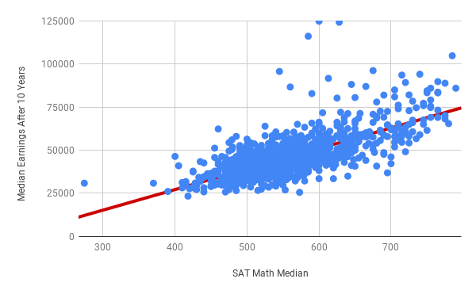
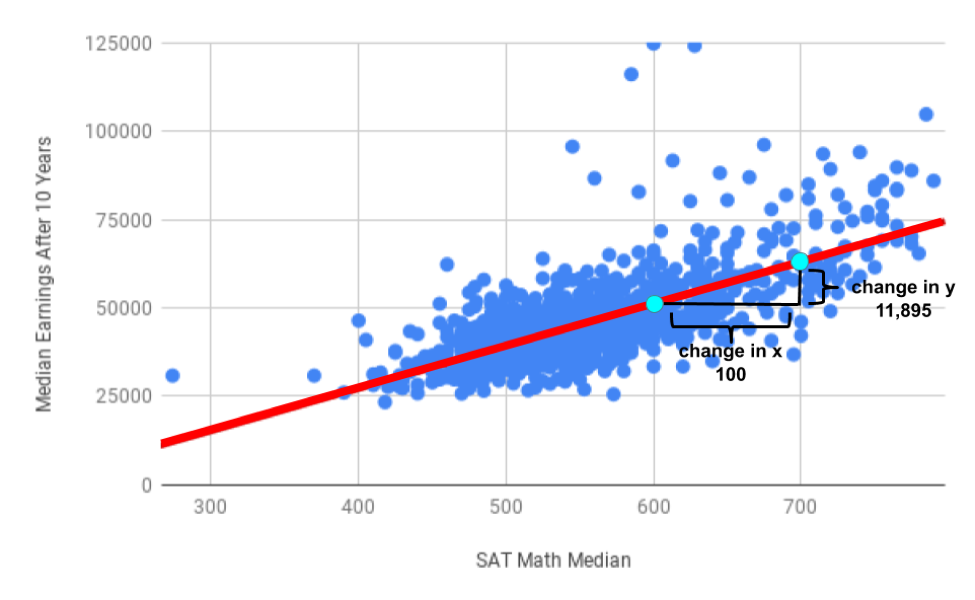
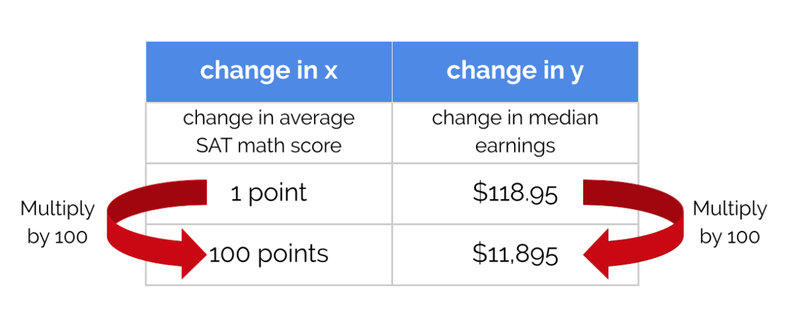
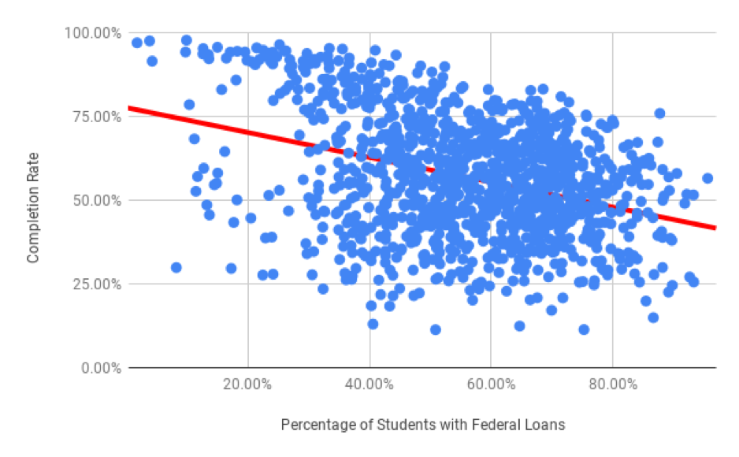

<!-- Copyright (C)  Google, Runestone Interactive LLC
  This work is licensed under the Creative Commons Attribution-ShareAlike 4.0
  International License. To view a copy of this license, visit
  http://creativecommons.org/licenses/by-sa/4.0/. -->

Interpreting Slope
==================

Now that you have reviewed linear equations, this section outlines how
that relates to data analysis. As mentioned in the previous section, the
slope gives the steepness of a line, but what does this mean?

You can start to answer this question by first understanding what slope
is. The [slope of a straight line](https://en.wikipedia.org/wiki/Slope)
tells you how much the y value changes when the x value is increased by

1. This is also written as the ratio

$$\frac{rise}{run} = \frac{\text{change in y}}{\text{change in x}}$$

You\'ve already learned about the correlation coefficient, *r*, which
tells you how strong the relationship between two variables is. Slope
tells you something different. The slope tells you the **magnitude** of
that relationship. In other words, the correlation helps you answer the
question "If variable A changes, how confident are you that variable B
will change?", while the slope helps you answer the question "If
variable A changes, *by how much* will variable B change?". Analyzing
slope becomes useful in scatter plots when looking at the line of best
fit.

You can practice this through an example. Below is a scatter plot with
median SAT Math score as the explanatory variable, and median earnings
after graduation as the explained variable. A line of best fit has
already been added to the graph. You can follow along with this example 
by using the [SAT data spreadsheet](https://docs.google.com/spreadsheets/d/1FCvsdw0wvtaD7G5tvOtMcHRMfoC0n-UFyjtidIW-wQE/edit?usp=sharing) which contains data from [College Scorecard.](https://collegescorecard.ed.gov/data/)

Notice that the data exhibits a general upward trend: in general,
schools with higher median SAT Math scores are more likely to graduate
students who earn a higher median income after 10 years. This is
confirmed by the line of best fit, which has a **positive** slope. To be
more precise, the equation of the line of best fit is
$y = 118.95 x - 20347.55$. Or, to use the names of the x and y
variables:

$$Predicted Median Earnings = 118.95 \times SAT Math Median - 20347.55.$$

The number multiplied by the x-variable is the slope, in this case
118.95. The constant at the end is the y-intercept, in this case
-20347.55. Further breaking down slope gives you the following:

$$slope = \frac{\text{change in y}}{\text{change in x}} = \frac{\text{change in
median earnings}}{\text{change in median SAT math score}} = \frac{118.95}{1} =
118.95$$

These values quantify how differences in one variable result in
differences in the predicted values of other variables. From the
equation above, because the slope is 118.95, when the median SAT math
score increases by 1, the median earnings increases by 118.95. In other
words, for each point increase in median SAT math score, the median
earnings increase by \$118.95. You can use this information when working
through the following example about two different colleges.

Suppose two schools are pretty similar in most regards, except that
College X has an average SAT math score that is 100 points higher than
University Y. Knowing the slope of the line of best fit in this case is
useful to predict how SAT score impacts other variables. Visually, this
relationship looks like the following:

You can incorporate this change into the equation for slope:

$$\frac{\text{change in median earnings}}{\text{change in median SAT math
score}} = \frac{118.95}{1} = \frac{11895}{100}$$

In words, this means that every 100 point increase in median SAT math
score corresponds with a predicted median earnings increase of \$11,895.
Another way to think about this is that if the change in median earnings
is \$118.95 for a 1 point increase in the median SAT Math score, and the
trend is linear, the change in median earnings is $100 \times $118.95$
(or \$11,895) for a 100 point increase in the median SAT Math score. You
can see this depicted in the following chart:

If College X had median SAT Math scores 100 points higher than
University Y, their graduates will make on average \$11,895 more per
year, after 10 years.

Example: SAT Scores and Loans
-----------------------------

This dataset has many other variables, and many other relationships to
examine. For example, does the percentage of students with federal loans
at a college impact its completion rate? Suppose your friend has been
accepted to College A and College B, and is very determined to graduate
within four years. However, she has to take some student loans, and is
trying to decide where to go. You don't know much about either school,
but College A has 10% more students with federal loans than College B.
This scatter plot shows the percentage of students receiving federal
loans as the explanatory variable, and completion rate as the explained
variable.

### Multiple choice

1. Using the scatter plot above, which school will have a lower completion
rate? (Specifically, which school will have fewer students graduating
within 6 years?)

**A.**   School A

**B.**   School B

The slope of the line of best fit this time is negative. The slope of
this line is negative because the line moves down from left to right,
just like the scatter plot which has a negative direction. This means
that in general, the higher the federal loans taken out to go to a
college, the lower the completion rate.

The equation of the line of best fit is:

$$Predicted Completion Rate = -0.371 \times
\text{Percentage with Federal Loans} + 0.775$$

You can interpret the slope as you have done before by breaking it into
the change in y over the change in x.

$$slope = \frac{\text{change in y}}{\text{change in x}} = \frac{\text{change in
completion rate}}{\text{change in percentage with federal loans}} = \frac{
-0.371}{1}$$

Therefore for every 1% increase in the percentage of students with
federal loans, the predicted completion rate drops by 0.37%. College A
and B have a difference of 10% in their federal loans percentage. To
determine how much that impacts the predicted completion rate, you can
multiply the slope by 10.

$$slope = \frac{\text{change in y}}{\text{change in x}} = \frac{\text{change in
completion rate}}{\text{change in percentage with federal loans}} = \frac{
-0.371 \times 10}{1 \times 10} = \frac{-3.71}{10}$$

Another way to think about this is that any change to x has to change y
proportionally. Therefore, if the change in x is multiplied by 10, the
change in y must also be multiplied by 10.

So College A and College B should differ in their completion rate by
3.71%. The negative value indicates that as the x value increases by
10%, the y value *decreases* by 3.71%.

However, that doesn't mean that students who have federal loans graduate
less often than students who don't! One issue is that this dataset is
about schools, not students. There are also many other factors at play.
For example, a school's financial resources is certainly a lurking
variable. Schools where students don't need federal loans often have
large endowments and give loans or scholarships directly to their
students. These same schools may also have other resources that
contribute to increased graduation rates.

### Multiple choice

2. Which of the following is the correct interpretation of the
slope of the line of best fit?

(Predicted Median Debt of Graduates) = 0.209 \* (Average Net Tuition) +
19043

**A.**   For every dollar that median debt increases by, average net tuition
    increases by .209 dollars.

**B.**   For every dollar that average net tuition increases by, median debt
    increases by 20.9%.

**C.**   For every dollar that median debt increases by, average net tuition
    increases by 20.9%.

**D.**   For every dollar that average net tuition increases by, median debt
    increases by .209 dollars.

Answers

 
 
1. A. School A, Because the direction of the scatter plot is negative,
        the school with the higher percentage of students with federal
        loans will have a lower completion rate. So College A will have
        a lower percentage of students graduating within 6 years.
 
2. B. For every dollar that average net tuition increases by, median debt
    increases by 20.9%.

