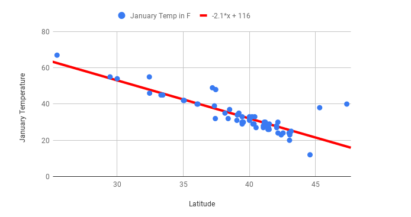
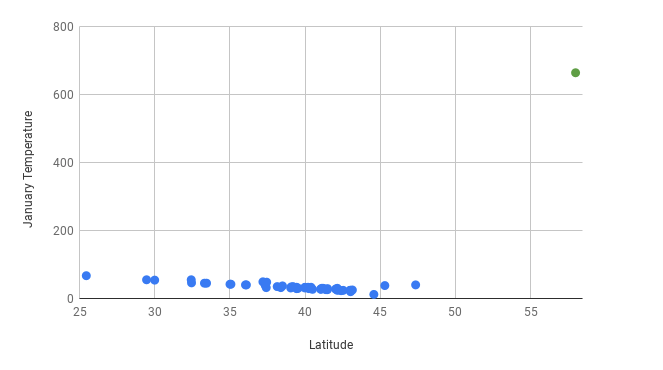
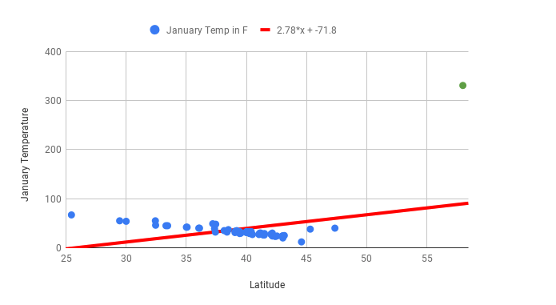
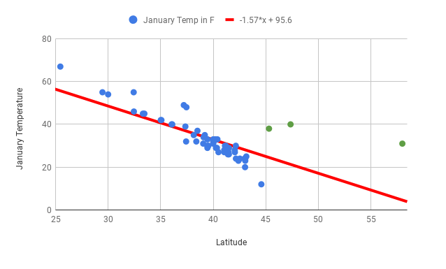

<!-- Copyright (C)  Google, Runestone Interactive LLC
  This work is licensed under the Creative Commons Attribution-ShareAlike 4.0
  International License. To view a copy of this license, visit
  http://creativecommons.org/licenses/by-sa/4.0/. -->

Outliers
========

As you saw in Module A, some statistics are very sensitive to extreme
values, also called [outliers](../basic_descriptive_statistics/outliers_and_skew.md).
This is also true for lines of best fit. One outlier can
significantly change what the line of best fit is for a graph.

You can see this very clearly by returning to the scatter plot of mean
January temperature and latitude for US cities. Here\'s what that graph
looked like:

First you should note the slope of this graph before an outlier is
added. The slope of this line is $-2.1*x + 116$. You can practice
interpreting what slope means by answering the following question:

### Multiple choice 

1. Fill in the blank by interpreting the slope: When the latitude
increases by 1, the predicted January temperature \_\_.

**A.**  Drops by -2.1 degrees

**B.**  Drops by 2.1 degrees

**C.**  Drops by 116 degrees

**D.**  Drops by 1 degree

This line fits the data well, and the correlation coefficient between
the two variables is -0.85, so any predictions are likely to be
reliable.

Now compare this to what happens when you add a data point for Juneau,
Alaska, where the average January temperature is 31 degrees. Also
imagine that there was a data entry error and someone entered 331,
rather than 31. Here's what the graph with the added outlier (the green
dot) looks like:

Looking at the scatter plot above, it's easy to identify the outlier
because it's visually far removed from all of the other data points.
Outlier identification makes scatter plots a good place to start when
analyzing quantitative data. If you find a data point that looks far
others like the one for Juneau, it's a good idea to investigate. It's
reasonable to guess that there wouldn't be cities that are so unusual
and so very far outside the line of best fit. Now imagine you find the
line of best fit and create the following graph:

Once you\'ve calculated the line of best fit and include the outlier of
Juneau, the line of best fit is way off. The slope is now positive and
the correlation coefficient has gone from -0.85 to 0.43! Correlation
coefficients and lines of best fit are very sensitive to outliers. Now,
imagine you've fixed the Juneau data point to create the following
graph:

### Multiple choice

1. If Juneau, Portland, and Seattle are excluded (all cities with
fairly high January temperatures in the Northern region, indicated in
green on the scatter plot above) from the dataset, what do you think
will happen to the line of best fit and the correlation coefficient?

**A.**  The line of best fit will have a steeper slope, and the correlation
    coefficient will be closer to 0.

**B.**  The line of best fit will have a shallower slope, and the
    correlation coefficient will be closer to 0.

**C.**  The line of best fit will have a steeper slope, and the correlation
    coefficient will be closer to -1.

**D.**  The line of best fit will have a shallower slope, and the
    correlation coefficient will be closer to -1.

You've seen that the line of best fit is very useful for making
predictions and for understanding the relationship between two
variables. Here are some important considerations to keep in mind.

-   To ensure that your predictions are accurate, make sure you aren't
    extrapolating. For example, if all of your cities have a latitude
    between 25 and 45 degrees, a prediction made about a city at 12
    degrees won't be very accurate.
-   Be careful if your dataset contains outliers as lines of best fit
    are very sensitive to extreme values. Even one outlier can change
    the direction of the line of best fit and dramatically reduce the R2
    value. For example, if the January temperature for Boston is
    accidentally recorded as 678 degrees, the line of best fit won't fit
    the rest of the data, and won't be useful for making predictions.
-   Report relationships between variables without assigning causation.
    For example, you can't state that increased latitude causes lower
    January temperature, but you can say that there is a strong
    relationship between latitude and temperature, and that greater
    latitudes are associated with lower January temperatures.

Answers

 
 
1. B. Drops by 2.1 degrees
 
2. C. The line of best fit will have a steeper slope, and the correlation
    coefficient will be closer to -1.
 

