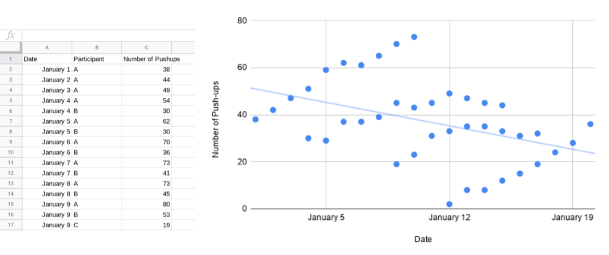
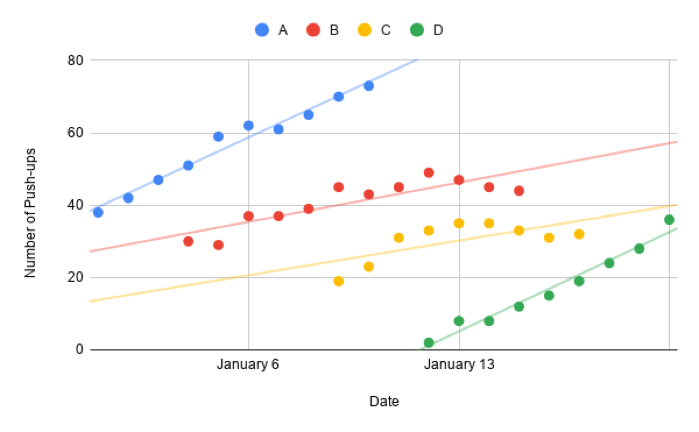

<!-- Copyright (C)  Google, Runestone Interactive LLC
  This work is licensed under the Creative Commons Attribution-ShareAlike 4.0
  International License. To view a copy of this license, visit
  http://creativecommons.org/licenses/by-sa/4.0/. -->

Correlation and Filtering
=========================

As you learned in Module A, filtering is a useful technique to help make
sense of a large dataset. Filtering data helps identify the similarities
and differences between groups and describe the relationships between
variables. Recall that a filter is a way of selecting a subset of rows
based on a set of column conditions. For example, if you have population
data over the past ten years for each state, you could use a filter to
analyze data only for Florida or only for the year 2017.\" Often, you
can only see important differences or trends by filtering. This is even
the case when finding the correlation coefficient that best reflects the
data. This is best explained through an example.

Imagine that your friend is a [personal trainer who has implemented a
new strength training
regime](https://docs.google.com/spreadsheets/d/1UPIYNKxl1bSDmiYQsDwN_mGk_mA0XxkvXZHYnNlebi8/edit?usp=sharing)
to use with her clients. An screenshot of this data is shown below:

Your friend wants to see if the new routine increases the number of
push-ups her clients can perform. It's a great routine and her clients
are working hard, so she expects a positive *r* value showing that her
clients can do more push-ups as they progress through the regime. Before
you start looking at each of the variables separately, think about what
types of variables you are working with by first answering some
questions. If you want to review what the different variable types are,
you can go back to the section on [variables](../basic_descriptive_statistics/variables.md).

### Multiple choice

1. What type of variable is Participant?

**A.**   Categorical

**B.**   Quantitative

2. What type of variable is Number of Pushups?

**A.**   Categorical

**B.**   Quantitative

As you have learned in the past, you can use the [CORREL](correlation_and_college_data.md)
function to calculate the *r* value. When calculating the *r* value, you
can see that it is -0.41. However, looking at the scatter plot, it looks
like each individual has improved. How is this the case when the overall
trend is negative? This is an example of [Simpson's
paradox](https://en.wikipedia.org/wiki/Simpson%27s_paradox), in which
every subset of a population shows the opposite effect to the population
itself. If the trainer could filter by participant, she could find the
correlation for each participant. Notice that the trends become more
apparent once the data is filtered by participant.

This graph shows that each participant has improved, and the correlation
coefficient for each individual would be positive. Although *r* values
can be useful, it is important that you closely examine data before
making conclusions using just one value.

Answers

 
 
1. Categorical
 
2. Quantitative

