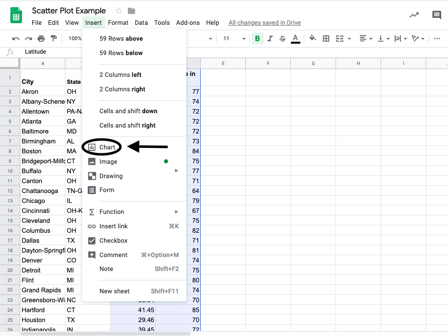
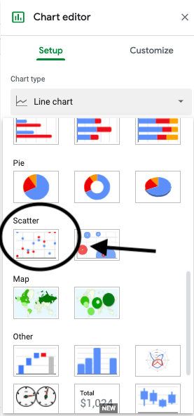
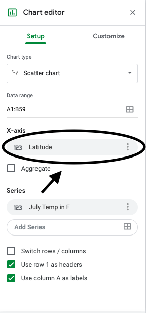
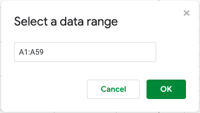
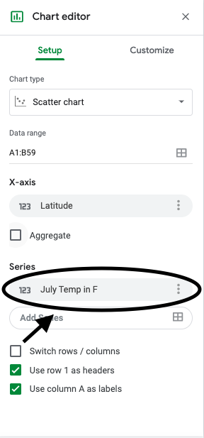
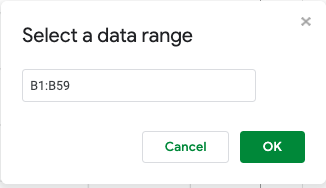
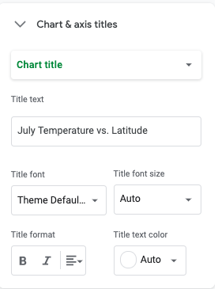
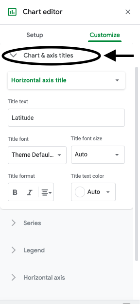
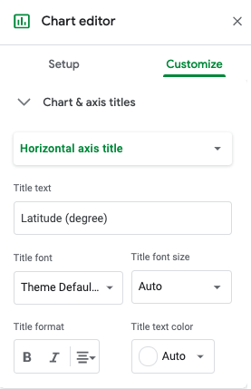

<!-- Copyright (C)  Google, Runestone Interactive LLC
  This work is licensed under the Creative Commons Attribution-ShareAlike 4.0
  International License. To view a copy of this license, visit
  http://creativecommons.org/licenses/by-sa/4.0/. -->

Creating a Scatter Plot in Sheets
=================================

In this section, you will learn how to make a scatter plot in Sheets.
You will work with the temperature data. Latitude will be the
explanatory variable, and July mean temperature will be the explained
variable.

How to make a scatter plot
--------------------------

First, copy over the city, state, latitude and July mean temperature
columns from the weather data here into a new sheet.

Afterwards, select the two columns containing the latitude and mean
temperature data then click "Insert \> Charts."

Then in the chart editor click "Setup \> Chart type \> Scatter."

Sometimes Sheets will correctly assign the columns to be either the
explanatory variable or the explained variable, but it is always good to
know how to manually assign them.

Go to "Chart Editor \> X-axis \> Edit " to choose which column of data
will be the explanatory variable.

Then put in the range of cells where you put the latitude data (the
explanatory variable).

To choose which column of data will be the explained variable, you will
go through a similar process. Go to "Chart Editor \> Series \> Edit."

Then put in the range of cells where you put the weather data (the
explained variable).

To add a title, go to "Chart Editor \> Customize \> Title."

To choose the horizontal and vertical axis labels, go to "Chart Editor
\> Customize \> Chart & axis title."

Then select "Horizontal axis title" and "Vertical axis title"
respectively to add a descriptive horizontal axis label and a
descriptive vertical axis label.

You now have a scatter plot for latitude versus July mean temperature.
Using the scatter plot, answer the questions below.

### Fill in the blank

1. What city represents the point furthest to the right on the
scatter plot?

2. What city represents the point closest to the y-axis on the
scatter plot?

Answers

 
 
1. Seattle
 
2. Miami-Hialeah
 

