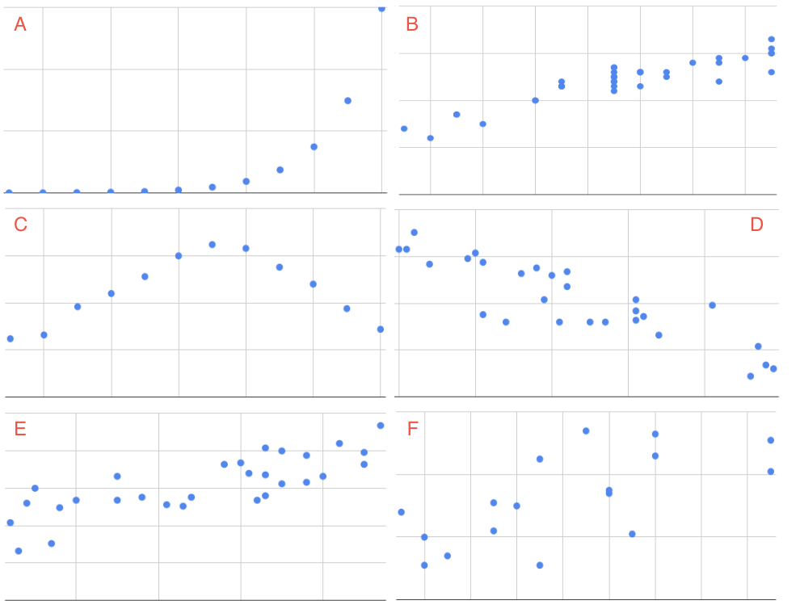
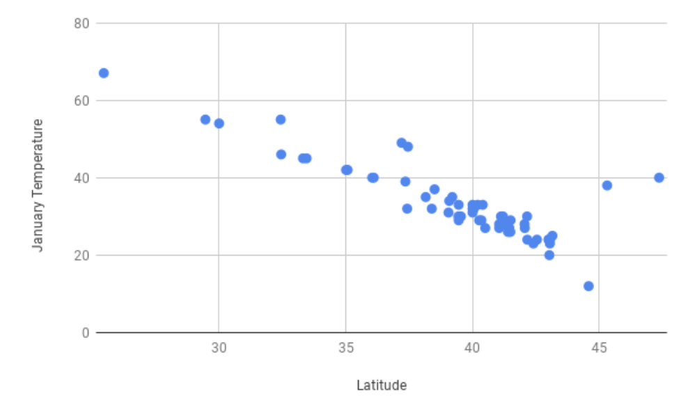
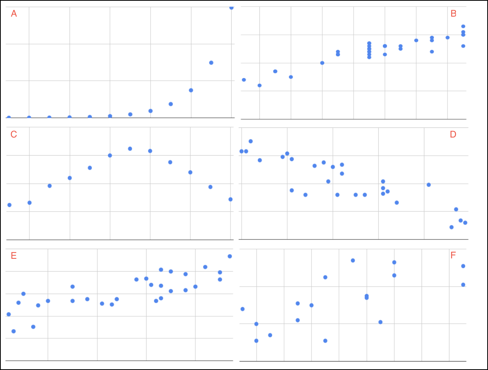

<!-- Copyright (C)  Google, Runestone Interactive LLC
  This work is licensed under the Creative Commons Attribution-ShareAlike 4.0
  International License. To view a copy of this license, visit
  http://creativecommons.org/licenses/by-sa/4.0/. -->

Describing Scatter Plots
========================

In this section you will learn how to identify the relationship between
variables in a scatterplot. These variables are the **explanatory** and
the **explained** variable that were by defined earlier in the
[scatterplots section](scatter_plots.md). The following activities ask you to
examine the scatterplots pictured and then match them with their description.

### Multiple choice

1. The explanatory variable (x) is age in years and the explained variable
(y) is the annual salary for a sample of working adults between the ages
of 18 and 65.

**A.**   E

**B.**   A

**C.**   D

**D.**   F

2. The explanatory variable (x) is the mean commute time in minutes and the
explained variable (y) is height in inches for a sample of employees at
a small company.

**A.**   F

**B.**   A

**C.**   D

**D.**   B

3. The explanatory variable (x) is the month of the year, starting in
January, and the explained variable (y) is the mean temperature for that
month for St. Louis, Missouri which has cold winters and warm summers.

**A.**   C

**B.**   A

**C.**   D

**D.**   B

4. The explanatory variable (x) is the city miles per gallon and the
explained variable (y) is the highway miles per gallon for a sample of
cars.

**A.**   C

**B.**   A

**C.**   D

**D.**   B

5. The explanatory variable (x) is the number of hours after e-coli has
been introduced to a petri dish and the explained variable (y) is the
estimated number of e-coli cells after t hours. The number of cells
doubles about every 20 minutes.

**A.**   C

**B.**   A

**C.**   D

**D.**   B

6. The explanatory variable (x) is the years of driving experience and the
explained variable (y) is the insurance premium paid for a sample of
drivers.

**A.**   C

**B.**   A

**C.**   D

**D.**   B

This exercise would be simpler given uniform adjectives that everyone
could understand. When describing the shape of the scatter plot and the
relationship between the explanatory and explained variable, there are
three important features to discuss.

-   The **direction** of a scatter plot can be described as positive or
    negative. The direction is positive when the explained variable
    increases as the explanatory variable increases, or the points of
    the scatterplot go up from left to right. The direction is negative
    when the explained variable decreases as the explanatory variable
    increases, or the points of the scatterplot go down from left to
    right.
-   The **strength** of a scatter plot is usually described as weak,
    moderate or strong. The more spread out the points are, the weaker
    the relationship. If the points are clearly clustered, or closely
    follow a curve or line, the relationship is described as strong.
-   The **linearity** of scatter plot indicates how close the points are
    to a straight line. Scatter plots are described as linear or
    nonlinear.

For example, the scatterplot of latitude and January temperatures had
negative direction, as the greater the latitude, the colder the
temperature. Though there are a few
[outliers](../basic_descriptive_statistics/outliers_and_skew.md) (cities
along the northwest coast of the US that have temperate winters, such as
Portland, OR) there is a strong, linear trend.

Given a new set of scatterplots below, repeat the same exercise, but now
with the new descriptions of strength, linearity and direction.

### Fill in the blank

Match each scatterplot above with its description.

7. Positive, strong, nonlinear

8. Positive, strong, linear

9. No relationship

10. Neither positive nor negative, strong, nonlinear

11. Positive, moderate, linear

12. Negative, moderate, linear

Answers

 
 
1. A. E, Most adults make more money as they get older, but many
        other factors such as education and career also impact salary.
 
2. A. F, There's no real relationship between height and commute
        time.
 
3. A. C, Cold winters and warm summers means smaller values
        close to the end points 1 = January and 12 = December, and
        higher temperatures in the middle.

4. D. B, Cars with higher city mpg also have higher highway mpg.

5. B. A, Because the number of cells is doubling, the change
        every 20 minutes at the beginning of the experiment is small
        compared to the change every 20 minutes at the end of the
        experiment when there are much more cells dividing.

6. C. D, Drivers with more driving experience are considered
        safer, so they pay smaller premiums. Similarly, drivers with
        less driving experience are considered riskier and pay greater
        premiums.

7. A

8. B

9. F

10. C

11. E

12. D

