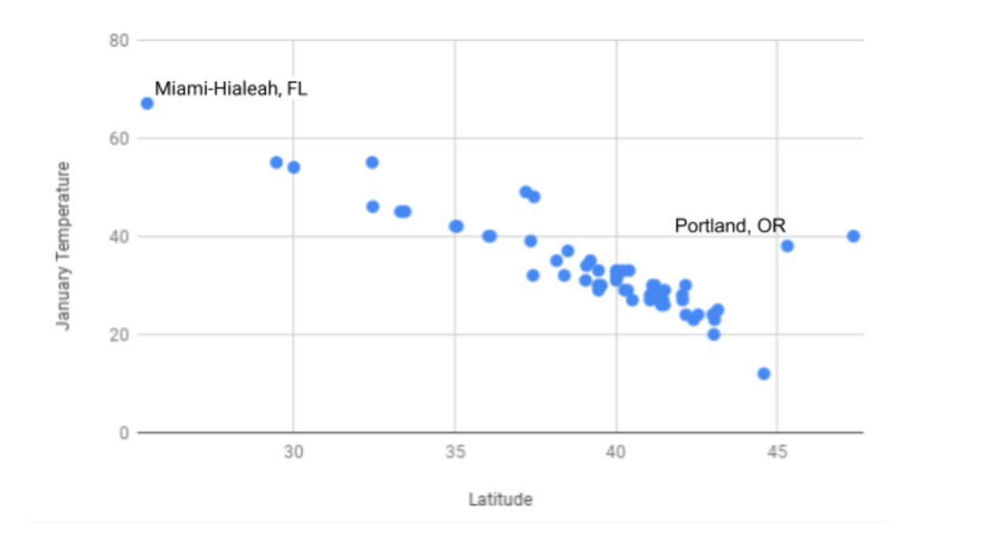

<!-- Copyright (C)  Google, Runestone Interactive LLC
  This work is licensed under the Creative Commons Attribution-ShareAlike 4.0
  International License. To view a copy of this license, visit
  http://creativecommons.org/licenses/by-sa/4.0/. -->

Introduction
============

You have already learned about histograms and bar charts, which are data
visualizations that are useful for understanding data. However,
sometimes these visualizations are not the most intuitive for looking at
individual pieces of a larger data set. This is where scatter plots come
in. Scatter plots are a type of data visualization that show the
relationship between two quantitative variables. An example of a scatter
plot is shown below. As you can see in the screenshot, each data point
is plotted individually onto a graph. By organizing data this way, it
becomes easier to understand trends in larger data sets.

In this section, you will learn how to create, read, and analyze scatter
plots. You will first begin by working through an example to see why
scatter plots are useful.
