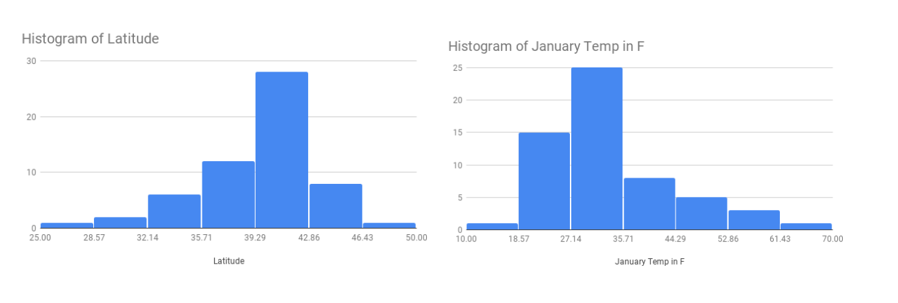
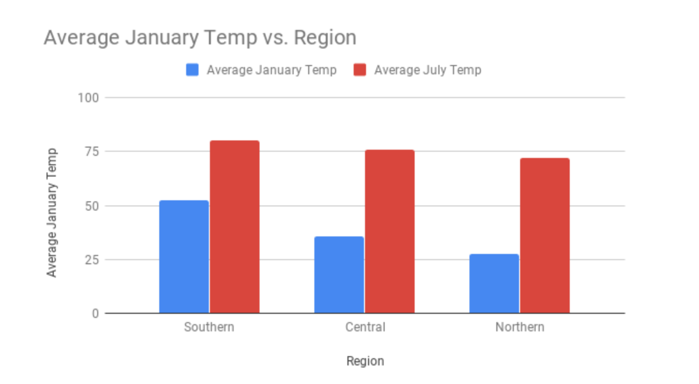

<!-- Copyright (C)  Google, Runestone Interactive LLC
  This work is licensed under the Creative Commons Attribution-ShareAlike 4.0
  International License. To view a copy of this license, visit
  http://creativecommons.org/licenses/by-sa/4.0/. -->

Motivating Scatterplots
=======================

Weather is something that changes based on location. Cities closer to
the north and south pole are generally pretty cold, while cities close
to the equator are generally pretty warm. But what if you wanted to
quantify this relationship in order to make specific predictions?
Instead of saying "cities are generally colder closer to the north
pole,\" you could say, "as latitude increases by 10 degrees, temperature
decreases by 20 degrees."

Given the [following
dataset](https://docs.google.com/spreadsheets/d/1ZmEmZwed-kGdDUDhxCxCzXtYLa4hRKZVoeRVQ5Cqo-M/edit?usp=sharing)
with [latitude,
longitude](https://en.wikipedia.org/wiki/Geographic_coordinate_system),
and weather data for different cities in the United States, you can use
histograms to plot latitudes and temperatures independently as shown
below.

Notice that this shows you the distribution of each variable alone, but
tells you nothing about the overall relationship between latitude and
temperature. How can you investigate the relationship with the tools you
have?

Since you know that temperature is related to location, you could group
the cities based on their latitude, and then compare the mean
temperature for each group. Comparing the means for each group will
quantify if and how much latitude impacts temperature.

A latitude closer to 0 degrees means a city is closer to the equator,
and a latitude closer to 45 degrees means a city is closer to the poles.
For cities in the northern hemisphere, like those in the USA, smaller
latitudes indicate southern cities, and larger latitudes indicate
northern cities. [See here for a map of the USA with latitude and
longitude
lines.](https://pasarelapr.com/images/map-of-usa-with-lines-of-latitude-and-longitude/map-of-usa-with-lines-of-latitude-and-longitude-2.jpg)

You can split up cities in the United States into three regions,
"Northern," "Southern," and \"Central\" to more easily analyze the data.
Most cities in the continental states are between 25 and 50 degrees, so
to group these, you can label cities south of 35 degrees latitude
"Southern", cities north of 40 degrees latitude "Northern," and those in
the middle "Central." This choice is somewhat arbitrary, but it breaks
the cities into three fairly even groups.

Break down these cities into these three separate groups by using the
`IF` function. Add a new column labelled location. Then create a formula
as shown in the screenshot below to group the cities.

Which region do you think will have the highest January temperatures?
What about the lowest July temperatures? Now, double check your
predictions by finding the mean temperatures of each of the three
regions. You can do this by using the `AVERAGEIF` function
[(from the section on grouping)](../filtering_and_grouping/grouping_data.md).

Now that you have found the mean temperature answer the following
questions:

### Multiple choice

1. What was the mean January temperature for cities in the Central region?
(Rounded to the nearest whole number)

**A.**   36

**B.**   20

**C.**   27

**D.**   33

2. What was the mean January temperature for cities in the Central region?
(Rounded to the nearest whole number)

**A.**   75

**B.**   71

**C.**   68

**D.**   77

3. Which region has the largest difference between its January mean
temperature and its July mean temperature?

**A.**   Northern

**B.**   Central

**C.**   Southern

Functions like `AVERAGEIF` are a great way to calculate the mean for a
specific region and/or month. But what if you want to see, in one
visualization, the mean temperature for January and July across all
regions? To do this, you can use a bar chart.

### Multiple choice

4. Looking at the visualization, which month has a bigger regional
difference in temperatures?

**A.**   January

**B.**   July

Although the above method is useful to determine the mean temperatures
of different regions in the United States, it is not the most accurate
since it applies over the whole region. For example, take the two cities
Dayton, Ohio and Memphis, Tennessee. Both of these cities are in the
Central region, but Dayton has a latitude of 39.54 degrees, while
Memphis has a latitude of 35.07 degrees, which are quite different.
Based on what you've learned, you could probably make an educated guess
about which of these locations are colder in January, but how could you
get a better prediction of what the temperature may be? This is where
scatterplots will come in handy.

Answers

 
 
1. A. 36
 
2. A. 75
 
3. A. Northern

4. A. January 

