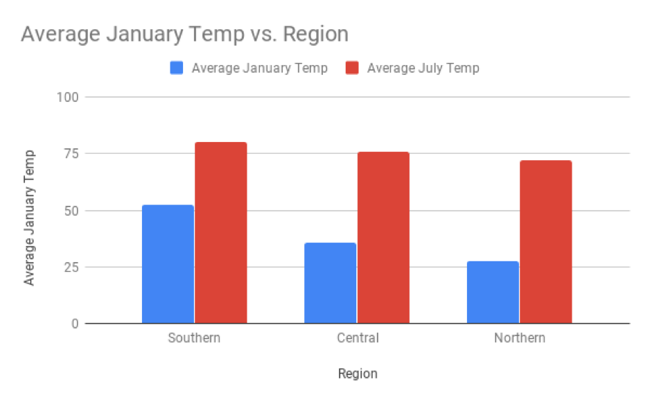
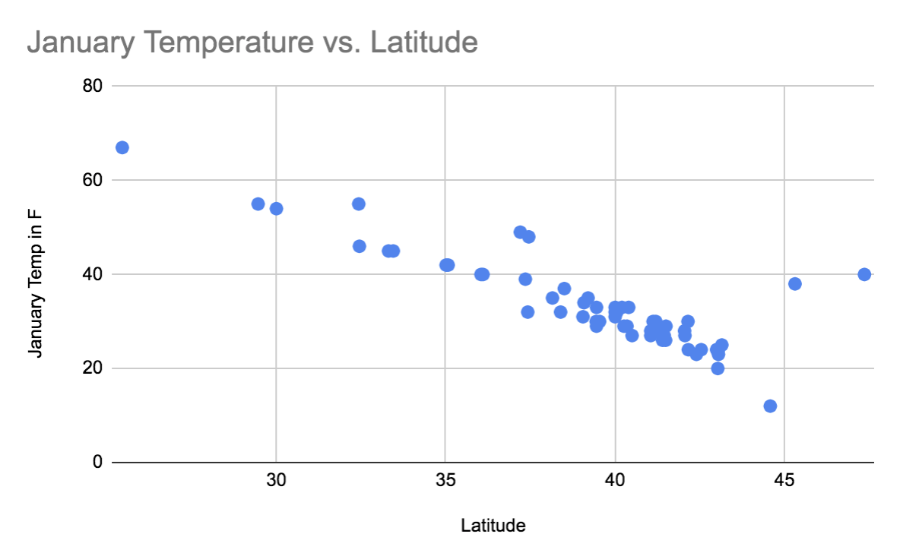

<!-- Copyright (C)  Google, Runestone Interactive LLC
  This work is licensed under the Creative Commons Attribution-ShareAlike 4.0
  International License. To view a copy of this license, visit
  http://creativecommons.org/licenses/by-sa/4.0/. -->

Scatter Plots
=============

Charleston, South Carolina, which has a latitude of 33 degrees, is not
included in this weather dataset. If you were asked to predict average
January temperatures there, you might make a good guess and say 52
degrees F, because that is the mean temperature for southern cities with
a latitude below 35. This was found using the bar chart that you saw in
the introduction:

The problem with this prediction is that it is the same for the entire
Southern region - that's a lot of cities! Could you make a better
prediction using the exact latitude of Charleston?

One way to have a more accurate prediction would be to create more than
three categories for regions. For example, you could have a group for
latitudes between 25 and 26 degrees, for 26 to 27 degrees, and so on. By
using cities with very similar latitudes, you could make a more accurate
prediction of Charleston's temperature. However, it would be tedious to
create so many groups. Rather than converting latitude to buckets of
variables (aka a [categorical
variable](../basic_descriptive_statistics/variables.md)),
you could use latitude as a [quantitative
variable](../basic_descriptive_statistics/variables.md).

Scatter plots show the relationship between two quantitative variables.
The variable on the x-axis is called the **explanatory variable**. The
variable on the y-axis is called the **explained variable**, because it
is being explained by the explanatory variable.

There are many synonyms for these terms, and the term used varies
between different texts and disciplines.

-   The variable on the x-axis can be called the **independent
    variable**. The variable on the y-axis is then called the
    **dependent variable**, as it depends on the independent variable.
-   The variable on the x-axis can be called the **predictor variable**.
    The variable on the y-axis is then called either the **response
    variable** or the **predicted variable**, as it is being predicted
    by the predictor variable.

To make it easier, this textbook will only use the terms "explanatory"
and "explained" variables.

In the graph below, latitude is the explanatory variable and mean
January temperature is the explained variable. Each city is represented
as a point, where the x-coordinate of each point is that city's
latitude, and the y-coordinate of each point is that city's mean January
temperature.

Using the scatter plot, you might predict that the January temperature
in Charleston would be between 45 and 50 degrees F, based on the
temperatures for cities with similar latitudes. The actual January
temperature in Charleston is 50 degrees F, so this prediction is more
accurate than the 52 degrees F predicted from the bar chart.

### Short answer

- Why did the scatter plot produce a more accurate prediction
that the bar chart?

### Fill in the blank

1. The latitude of El Paso, Texas is 31.7 degrees. Use that to
predict the January temperature in El Paso.

The city of Juneau, Alaska has a latitude of 58 degrees. Because there
are no other cities in the dataset with similar latitudes, it is not
possible to make a reliable guess about the January temperature in
Juneau. Trying to make a prediction about values not represented by your
data is called **extrapolation**, and predictions made in this way are
considered unreliable.

Answers

 
 
1. An answer between 45 and 55 or so.
 

