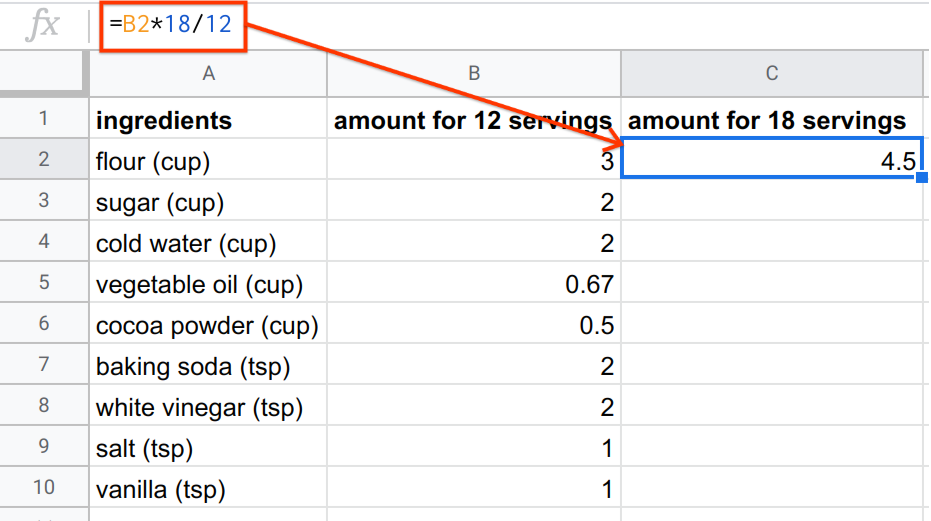
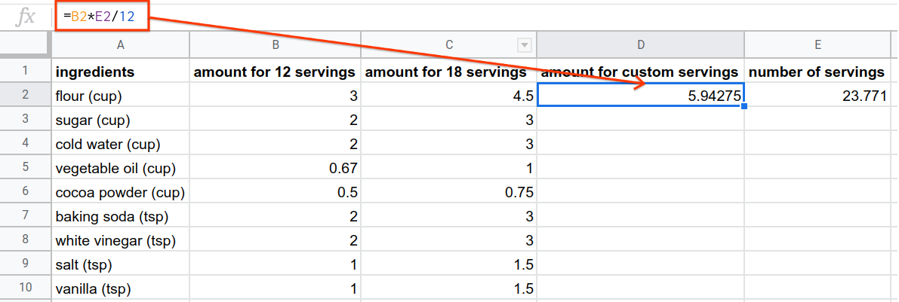
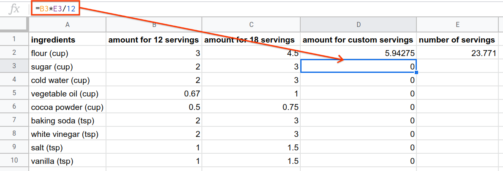
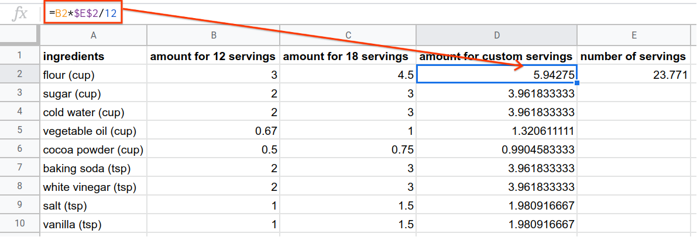

<!-- Copyright (C)  Google, Runestone Interactive LLC
  This work is licensed under the Creative Commons Attribution-ShareAlike 4.0
  International License. To view a copy of this license, visit
  http://creativecommons.org/licenses/by-sa/4.0/. -->

'What Is A Formula?'
====================

Formulas are a way of manipulating data in Sheets. A formula processes
data in the same way a calculator does, but in a more organized and
useful way that allows you to combine calculations.

All formulas start with the `=` character. This tells Sheets that this
cell is a formula, rather than raw data. What makes formulas so useful
is that the input to a formula can be new data (e.g. `=1+1`), or
existing data from cells (e.g. `=A1+A2`), or a combination (e.g.
`=A1+1`). Below are some illustrative examples of how formulas work.


|   |                formula               | result |
|---|--------------------------------------|--------|
|  1| &#61;1+1                             | 2      |
|  2| &#61;2^2                             | 4      |
|  3| &#61;(1+1=3)                         | FALSE  |
|  4| "&#61;CONCATENATE(""abc"", ""xyz"")" | abcxyz |
|  5| &#61;B2+B3                           | 6      |
|  6| &#61;2^B3                            | 16     |
|  7| &#61;-B6/10                          | -0.6   |

Note that if Sheets cannot parse or calculate your formula, you will see
an error. See [this section](errors.md) for more on errors.

### Fill in the blank

1. Write a formula to calculate $2^{10}$.

2. Use Sheets to calculate $-1.23 * 9.87$ to 2 decimal places.

Example: Chocolate Cake
-----------------------

Suppose you are going to a party, and you decide to bake a cake. Your
favorite is chocolate cake, so you decide to make [this "quick chocolate
cake"](https://www.bhg.com/recipe/chocolate-cakes/quick-chocolate-cake/).
You note that the recipe serves 12, so you ask the party hosts how many
guests are attending. They say they will need 18 servings.

Since you are now more familiar with Sheets, instead of manually
calculating, for each ingredient, how to alter this recipe for 18
people, you use a formula. Sheets allows you to perform the same
calculation for all ingredients, with one formula.

First, you enter the recipe for 12 servings into a table. (Note that for
the ingredients with fractional amounts like 2/3 cup vegetable oil, you
need to use a formula, namely `=2/3`).

|  |       ingredient    | amount for 12 servings |
|--|---------------------|------------------------|
| 1| flour (cup)         |              3         |
| 2| sugar (cup)         |              2         |
| 3| cold water (cup)    |              2         |
| 4| vegetable oil (cup) |              0.67      |
| 5| cocoa powder (cup)  |              0.5       |
| 6| baking soda (tsp)   |              2         |
| 7| white vinegar (tsp) |              2         |
| 8| salt (tsp)          |              1         |
| 9| vanilla (tsp)       |              1         |

Now, you know that for 18 people, you will need to scale up everything
to 18. You can do this by multiplying each ingredient by the scale
factor of 18/12. (You can think of this as dividing by 12 to get the
amounts for 1 serving, then multiplying by 18 to get the amounts for 18
servings.)

You can use column C to write a formula to get the amounts for 18
servings. First, you need to write the formula for row 2, namely flour.
The amount for 12 servings is in cell B2. You want to upsize this
ingredient by a factor of 18/12, so the formula is as follows.

```
=B2*18/12
```



So for 18 servings, you need 4.5 cups of flour. Now, it's as simple as
copy-pasting this same formula to the other rows. You can do this using
in-built copy-paste functionality, or you can drag down from the corner
of the cell.

### Fill in the blank

3. How many cups of cocoa powder do you need for 18 servings?

The best thing about Sheets is that you could recreate this recipe no
matter how the numbers change. For example, suppose the hosts ask you to
bring enough for 23.771 servings. (There are 24 people, but one person
is on a diet, and has asked for only 0.771 servings.) You can actually
encode the number of servings into the formula, so that the shopping
list automatically updates whenever you update the number of servings.

Use column D to show the amount required for the custom number of
servings, and use cell E2 to store the desired number of servings, as
below.


Now, you can write a formula in column D, similar to the formulas in
column C, except instead of **hardcoding** (entering a number manually)
the number of servings, use cell `E2` to indicate the number of servings.



### Short Answer

- What do you think will happen if you drag this formula to the rows
below?

As was done in column C to calculate the recipe amounts for 18 servings,
try dragging the formula in column D down to the rows below. You should
observe that in this case, copy-pasting the formula did not behave as
you might have wanted it to.

- Why do you think copy-pasting this formula produced all zeros?

The formula in cell `D2` references cells `B2` and `E2`. When you copy-paste
this formula to `D3`, Sheets assumes you want the formula to update to
reference cells `B3` and `E3`.

{.align-center}

This is called **relative referencing**, because cell referencing in the
formula is relative to where the formula is used. (So when it is used in
`D3`, it references `B3` and `E3`.) If you want a cell reference to *not*
update when the formula is copy-pasted, you need to use **absolute
referencing**.

Sheets assumes references are relative. To tell Sheets to reference a
cell absolutely, you need to use the `$` symbol.

Consider the cell `A1` used in a formula:

-   If you use `A1` in a formula, this is an implicit relative reference.
    Any cell you copy the formula in will reference a different cell.
-   If you use \$A\$1 in a formula, this is an absolute reference. Any
    cell you copy the formula in will still reference \$A\$1.

You might be wondering what happens if you only include one of the `$`
symbols when referencing `A1`. This is called semi-absolute referencing,
and can be used to keep the row or column as an absolute reference while
using the other as a relative reference. [You can learn more about cell
referencing
here.](https://edu.gcfglobal.org/en/googlespreadsheets/types-of-cell-references/1/)

As an example, suppose you have the following sheet.

|    | A  |
|:---|----|
|  1 | 1  |
|  2 | 2  |
|  3 | 3  |
|  4 | 4  |
|  5 | 5  |
|  6 | 6  |
|  7 | 7  |
|  8 | 8  |
|  9 | 9  |
| 10 | 10 |

### Short Answer

- Copy this data to a spreadsheet, and in cell B1, enter the formula
`=A1*$A$2`. When you copy-paste this formula down, what numbers do you
expect to see?

In this chocolate cake example, you want column B to be referenced
relatively (so when you copy-paste to rows below, it updates itself),
but cell `E2` to be referenced absolutely. So, the formula for cell `D3`
should be as below.

```
=B2*$E$2/12
```

Copy-pasting this formula down for the other ingredients now works as
intended.

{.align-center}

Now, if you update the number of servings you need in cell E2, the
amounts for the shopping list magically update themselves.

### Fill in the blank

4. If 9.87 servings are required, you will need teaspoons of vanilla. Use 2
decimal places in your answer.

Doing all of these steps manually, for each ingredient, would be
challenging and may result in miscalculations. Doing it in Sheets might
take some getting used to, but once you have the hang of using formulas,
it makes calculations like this extremely simple!

Example: The Fibonacci Sequence
-------------------------------

While it is sometimes useful to use formulas as a type of calculator,
formulas are most powerful when extending the same operation to multiple
rows or columns. To illustrate this, consider [the Fibonacci
Sequence](https://en.wikipedia.org/wiki/Fibonacci_number).

**The Fibonacci Sequence is a sequence of positive numbers where each
number is the sum of the previous two numbers in the sequence.** The
sequence starts with the numbers 0, 1, 1, 2, and goes on infinitely. The
sequence looks like:

``` {.none}
0, 1, 1, 2, 3, 5, 8, 13, 21, ...
```

### Fill in the blank

5. The next two numbers in the sequence are __ and __.

The Fibonacci sequence has a very special and fundamental relationship
with nature and art. It can predict, for example, the [number of rabbits
in a
population](https://science.howstuffworks.com/math-concepts/fibonacci-nature.htm).
Fibonacci numbers also appear in [flower and leaf
growth](https://www.mathsisfun.com/numbers/nature-golden-ratio-fibonacci.html).
The real-life examples of the Fibonacci sequence don't stop there. As
the numbers in the Fibonacci sequence get larger and larger, the ratio
between consecutive numbers in the sequence gets closer and closer to
the [golden
ratio](https://en.wikipedia.org/wiki/Golden_ratio#Relationship_to_Fibonacci_sequence).
This number is prevalent in pure mathematics, physics, nature,
sculpture, architecture, and art (for example in the [Mona
Lisa](https://thefibonaccisequence.weebly.com/mona-lisa.html)). [You can
read more about the golden ratio's appearance in classical and modern
art here.](https://news.artnet.com/art-world/golden-ratio-in-art-328435)

Now, suppose you wanted to generate the 50th number of the Fibonacci
sequence. You could do this by hand with lots of mental arithmetic, but
this would take a long time and could lead to errors. You could use a
calculator, but that would still require you to type about 50 individual
sums, which would take a long time. Let's instead look at how using
Sheets can help you save time and prevent mistakes.

In Sheets, the Fibonacci sequence can be generated with one simple
formula that you can then extend to get as many numbers in the sequence
as you need.

1.  Start by manually entering the initial numbers of the sequence: 0, 1
    in cells A1 and A2.
2.  The third number in the sequence is the sum of the previous two
    numbers, so enter the formula `=A1+A2` in cell A3.
3.  This formula in Sheets is `=A1+A2`. Since each cell is referenced
    relatively, it actually means "add the two numbers above this cell".
    Therefore, if you copy-paste this formula to the next cell A4,
    Sheets interprets this as the formula `=A2+A3`.
4.  This can be extended to any number of cells. Drag the formula (or
    copy-paste it) to all cells in A up to A50, to show the 50th
    Fibonacci number.

So the 50th number in the Fibonacci sequence is 7,778,742,049! In this
example, each cell adds the two previous cells, which in turn is used to
calculate the next cell. This is a type of **recursive formula**, where
the same formula is being used over and over, but with different inputs.

Calculating this by hand or using a calculator would have taken way too
much time and brainpower. Sheets lets you spend your time and brainpower
on more important things!

6. What is the first digit of the 100th Fibonacci number?


Example: Painters 
-----------------

To further illustrate how formulas can automate data processing,
consider the painters dataset again. Don't worry if this example seems a
bit daunting at first; it is designed to be challenging.

Suppose you're interested in studying only the most prolific French
painters, specifically French painters who produced over 200 paintings
in their lifetimes. (Note that there are a few painters with multiple
nationalities listed. For the purposes of this example, consider
"French" to mean only French listed as a nationality.)

First, let's create a column that shows whether the painter was
"prolific" by your definition. Each new formula should be in a new
column. You can use column I to write this formula. Remember that you
only need to write a formula for one row and it can be copy-pasted to
the other rows, as was done in the Fibonacci example.

Start with the first observation row, row 2. (Row 1 contains the column
headings.) The painter is Amedeo Modigliani. Column H contains the
number of paintings. So, to see if Amedeo Modigliani painted over 200
paintings, column I should contain the following formula.

``` {.none}
=H2>200
```

This formula evaluates to `TRUE` only if the value in H2 is greater than
200 and `FALSE` if it's not. You can then drag down or copy-paste that
formula to the remaining rows.

Now, you can use column J to write a formula to show whether or not each
painter was French. Column E contains the nationality, so to see if
Amedeo Modigliani is French, column J should contain the following
formula.

``` {.none}
=E2=“French”
```

This formula might be a bit confusing due to the use of two `=`
characters. The first `=` is telling Sheets that this cell contains a
formula. The second `=` is a comparison (just like `<` or `>`),
comparing cell E2 to the word "French".

Once you have your answer for Modigliani, you can copy-paste this
formula for the other painters as well.

Going back to our original question (which French painters painted over
200 paintings in their lifetimes?), we must have a final answer to
satisfy both conditions:

-   That the painter painted 200 paintings
-   That the painter was French

This means both column I and column J must be `TRUE`. Rather than
manually checking each answer, which can lead to mistakes, especially
when you are working with hundreds of rows of data, you can use the
`AND` function.


#### The `AND` Function

The `AND` function returns `TRUE` if and only if each statement
separated by a comma within its brackets are `TRUE`. The syntax looks as
below.

``` {.none}
=AND(statement1, statement2, ...)
```


In this case, `AND` is used to check that both I2 and J2 are `TRUE`, so
the formula looks as below.

``` {.none}
=AND(I2=TRUE, J2=TRUE)
```

As usual, once this formula has been written for Amedeo Modigliani, it
can be dragged or copy-pasted for the other 49 painters. This gives a
`TRUE` or `FALSE` in column K for all painters as to whether the listed
painter was classified as a prolific French painter.

You might, however, find that column K is still a little hard to digest,
and doesn't present you with a succinct list of the prolific French
painters in this dataset. Adding another formula in column L can help
with that! In this column, you can write a formula that prints the
artist's name if they are prolific and French, and prints nothing if
not. This can be done using the `IF` function.

#### The `IF` Function

The `IF` function is used to show different results based on a
condition. The syntax looks as below.

``` {.none}
=IF(condition that is true or false,
    what to print if statement is TRUE,
    what to print if statement is FALSE)
```

Since column K contains a condition that tells you whether the artist is
prolific and French, all you need to do is print the artist's name
(which appears in column B) if `TRUE`, and an empty cell if `FALSE`.
(The empty cell actually contains the blank word "".) So the formula in
column L for the first painter should look as follows.

``` {.none}
=IF(K2, B2, “”)
```

You can then drag down this formula to show the name of all French
painters who painted over 200 paintings.

### Multiple Choice

7. Who are the French painters who painted over 200 paintings?

**A.**   Titian

**B.**   Pierre-Auguste Renoir

**C.**   Paul Gauguin

**D.**   Diego Rivera

**E.**   Claude Monet

**F.**   Edgar Degas


Of course, instead of using four formulas to find these painters, you
could do this all in one formula, by wrapping each step into the next.
However, when first starting, it helps to isolate each step into its own
formula.

### Short Answer

- Find all (exclusively) Italian painters who painted fewer than 400
paintings.


<details>
<summary>Answers</summary>
<br>

1. =2\^10

2. -12.14

3. 0.75

4. 0.82 (The original recipe made 12 servings, not 1)

5. 34 and 55

6. 2 (Remember 0 is the first Fibonacci number)

7. Pierre-Auguste Renoir, Paul Ganguin, Edgar Degas
</details>
