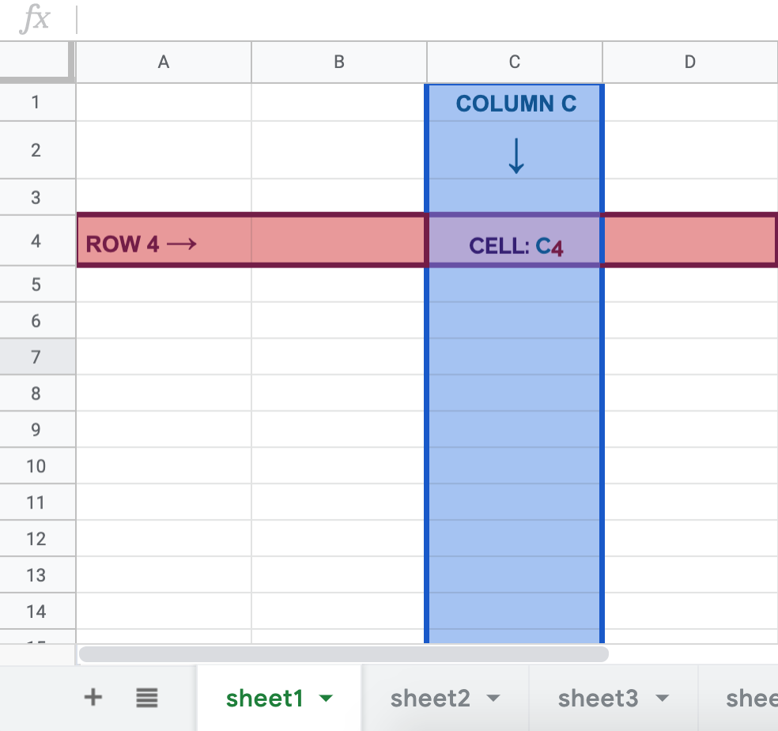
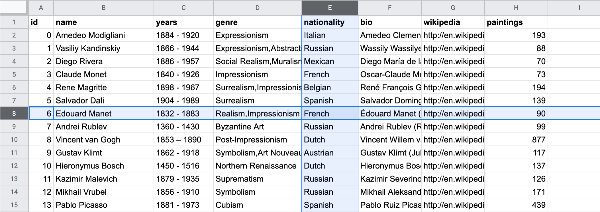

<!-- Copyright (C)  Google, Runestone Interactive LLC
  This work is licensed under the Creative Commons Attribution-ShareAlike 4.0
  International License. To view a copy of this license, visit
  http://creativecommons.org/licenses/by-sa/4.0/. -->

'What Is A Sheet?'
==================

Fundamentally, a spreadsheet (also known as a sheet) is a table, or a
matrix. It is a 2-dimensional way of viewing **data** (any form of
information used for reference or analysis), through rows and columns.
Spreadsheets are used to store, manipulate, and analyze data. You can
create a spreadsheet using Google Sheets, which is simply referred to as
Sheets throughout this textbook. Sheets is often used to store
**datasets**, which are related sets of different data points. Below is
the key terminology you need to know when using Sheets.

Basic Definitions

-   **Cell**: A cell is the smallest unit in a sheet. Each cell can
    contain any form of data.
-   **Column**: A column is a vertical group of cells, defined in Sheets
    with a *letter*.
-   **Row**: A row is a horizontal group of cells, defined in Sheets
    with a *number*.
-   **Sheet**: A sheet is a singular page in a Sheets document. A sheet
    contains its own table. You can create as many sheets within one
    document as as you like.

Note that a cell is usually defined by a letter and a number (in that
order, by convention): the letter of the column and the number of the
row. In the image below, **the highlighted cell is C4, meaning the
column is C, and the row is 4**. The current sheet is called sheet1.

Example: Painters
-----------------

The definitions above might be a bit abstract. Sheets makes a lot more
sense when there is data, so here is an example. In [this
dataset](https://docs.google.com/spreadsheets/d/1Yb_HCT2Dvdo5J_dbQdEifb3ymXMyrWSnPKKmERRnIB8/edit#gid=30572353),
there is information about 50 of the most prolific painters of all time.

In general:

-   **Each row is an observation of the data.** In this example, each
    row is a painter. For example, row 8 (where id = 6) tells you about
    Edouard Manet. If you were to add a new painter to this dataset, you
    would add a new row. You can add a new row by clicking \"Insert\" in
    the menu bar, and selecting either \"Row Above\" or \"Row Below.\"
-   **Each column is an attribute of the data.** In this example, each
    column tells you something about the painter (e.g. "name", "years").
    For example, column E tells you about a painter's nationality. If
    you were to add a new attribute to this dataset (e.g. the number of
    children they had), you would add a new column. You can add a new
    column by clicking \"Insert\" in the menu bar, and selecting either
    \"Column Above\" or \"Column Below.\"
-   **Each cell is an attribute of an observation.** In this example,
    each cell tells you something specific about a given painter. For
    example, cell E8 tells you that Edouard Manet was French. If you
    have new information for an existing artist and attribute (e.g. you
    found out that Salvador Dali was French, not Spanish), you would
    update a cell.

Use [this
dataset](https://docs.google.com/spreadsheets/d/1Yb_HCT2Dvdo5J_dbQdEifb3ymXMyrWSnPKKmERRnIB8/edit#gid=30572353)
to answer the following questions.

### Multiple Choice

1. What nationality was Pablo Picasso?

**A.**   French

**B.**   Belgian

**C.**   Spanish

**D.**   Italian

### Fill in the blank

2. In what year did Leonardo da Vinci die?

3. If you wanted to change the genre of Andy Warhol, what cell would you
have to alter?

Answers

 
 
1. Spanish
 
2. 1519
 
3. D47 (Don't get the row number mixed up with the value in
        the "id" column)

