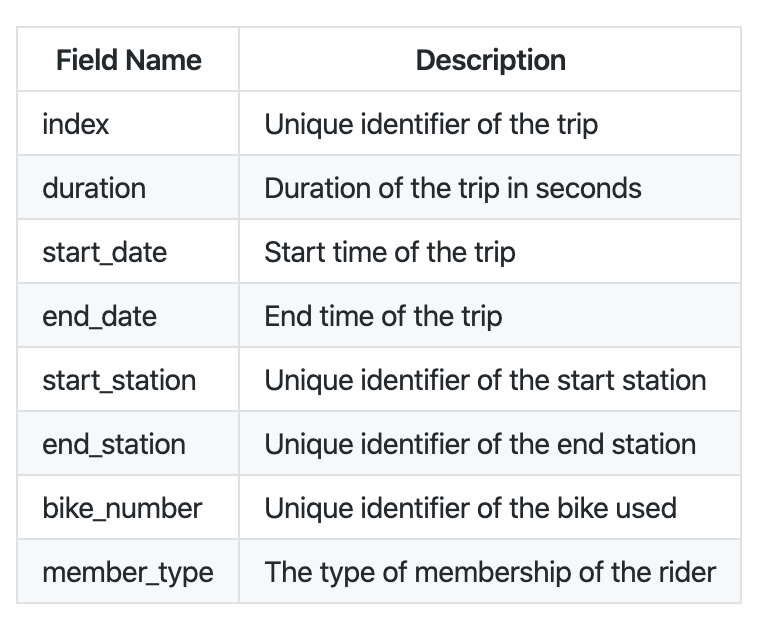

<!-- Copyright (C)  Google, Runestone Interactive LLC
  This work is licensed under the Creative Commons Attribution-ShareAlike 4.0
  International License. To view a copy of this license, visit
  http://creativecommons.org/licenses/by-sa/4.0/. -->

Selecting
=========

Selecting in SQL is how you can choose a portion of data from a
database. This is helpful when you are given a large dataset, and want
to focus in on a smaller portion of the data. Say you are conducting
research about bike sharing for an internship in Washington D.C. You are
given the Capital Bike Sharing dataset, which is hosted on a SQLite
database and contains information on Washington D.C.'s bike share
program for 2011.

You may recall that in Sheets, you could select certain sections of data
by specifying a cell range or by simply clicking and dragging. In SQL,
you can do something similar, but rather than specifying a cell range,
you\'ll need to write some code to accomplish the same behavior. Don\'t
worry if you\'ve never written code before --- SQL code actually looks a
lot like English!

SQL **keywords** are generally written using all **upper case**, while
**column names and table names** use **lower case**. You can see this in
the following example.

Suppose that you have a table called `trip_data`. The following SQL
query is an example of how to view the top 10 rows of the table. This
query is using SQL to ask the database to `SELECT` all columns (`*` is a
shorthand denoting "all columns") `FROM` the table named `trip_data`,
but to `LIMIT` the output to the first 10 rows.

``` {sql}
SELECT
   -
FROM
   trip_data
LIMIT
   10
```

Note that SQL does not notice line breaks, so SQL queries are usually
spread across multiple lines for ease of readability. The above query
allows you to read the column names and 10 example rows of data. From
this query, you can see all of the columns in the table which are listed
below.



However, in general, it might not make sense to display all the columns
in a table. This is especially true if your table has a large number of
columns. SQL allows you to select whichever columns you want. For
example, if you just want to see the `member_type`, `start_date`, and
`duration` columns, the query would look like the following.

``` {sql}
SELECT
   member_type, start_date, duration
FROM
   trip_data
LIMIT
   10
```

However, maybe you just want to see the number of rows in your dataset
rather than individual data points. Similar to the `COUNT` function in
Sheets, you can use `COUNT(*)`. Recall that `*` means all, so this
function counts the total number of rows. This is show in the code block
below.

``` {sql}
SELECT
   COUNT(\*) AS n\_rows
FROM
   trip\_data
```

Notice that the `AS` keyword is used after `COUNT(*)`. This names the
column that counts the number of rows as `n_rows`. This is similar to
creating a new column in Sheets and naming it n_rows. In general,
whenever you select a column that is not one of the existing columns of
the table, you should use the `AS` keyword to name it something
informative.

Now that you have learned a bit about selecting in SQL, try out the
following example.

### Fill in the blank 

1. Write a query to select the start and end stations for all trips. (Hint:
You will want to use the `SELECT` and `FROM` keywords).

<details>
<summary>Answers</summary>
<br>

1. 31104, 31200, 31230, 31620, 31224, 31221

</details>
